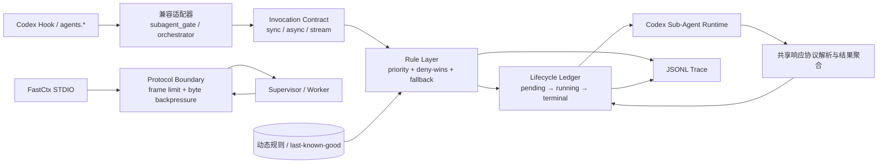

# Codey 内部开发文档

本文档面向 Codey 的开发和维护，保留实现细节、构建发布流程、配置路径、启动恢复机制和已知限制。面向使用者的功能介绍只维护在 `README.md`；不要把协议、端口、路径、构建命令、数据库结构、补丁策略或其他内部技术细节迁回公开 README。

Codey 是一个无界面的 Rust 桌面辅助进程，通过 CDP 连接官方 Codex Electron 客户端，并把 React 配置控制台直接注入 Codex 页面内的隔离浮层。官方账号线路与 Codey 保存的第三方线路都通过每次启动创建的 loopback Responses 网关统一接入；官方请求继续使用 Codex 的 ChatGPT OAuth，第三方请求则由网关替换为目标线路自己的 API Key。该网关负责入口认证、独立线路元数据解析、旧模型别名兼容、上游鉴权隔离，并按线路协议直接转发 Responses，或把 Responses 请求适配为 OpenAI Chat Completions / Anthropic Messages 后再把响应还原为 Responses。运行时 provider 与入口地址由 Electron 启动补丁通过 app-server 单次 `-c key=value` 覆盖注入，用户 `config.toml` 除窄范围旧版污染修复与 `codey_router` 恢复桩外保持只读；无法识别的旧协议值按统一默认规则归一为 Responses。租约只负责 Codey 独立 Hook、子代理证明策略和应用自有运行文件的清理。

提示词优化走 Codey 官方账号线路时复用本次 loopback `/v1/responses`，但该本地官方代理接受的请求 schema 比第三方 Responses 更窄：必须显式发送 `store: false` 与 `stream: true`，并且不能发送 `max_output_tokens`。手动配置和第三方 Responses 线路仍保留 `max_output_tokens`，以维持现有输出上限行为；官方优化响应按 SSE 的 `response.output_text.delta` 聚合文本。

## 当前能力

- 官方登录在 Codey 内统一规范为内置 `openai` provider；启动时遇到旧官方 provider ID，会迁移该线路的模型列表、旧线路默认、全局默认以及子代理模型别名。renderer 模型目录显式下发 `official_account`，同时继续识别旧 `local-official` 目录，避免以模型或线路 ID 名称猜测官方身份。
- 任务路由分别保存 rollout 中的持久 provider 与本次进程的 runtime carrier。`thread/resume` 会把任何带已知持久 provider 的旧任务迁入 `codey_router`；迁移后，后续 `thread/list` 只能刷新持久 provider，不能把 runtime carrier 降级回旧供应商。因此旧版或非本机同步任务可在同一任务中跨官方与任意第三方线路切换；尚未完成运行时迁移的发送仍等待下一次恢复，模型归属缺少可信线路证据且存在歧义时继续 fail closed。

- 普通启动只把固定的自定义 `codey_router` provider 指向本次 loopback 网关；只要官方账号线路本次可用，或至少一条第三方 Responses 线路显式声明 WebSocket 能力，运行时 provider 就声明 `supports_websockets = true`；模型目录给官方线路和显式开启的第三方线路的 route-aware 模型设置 `prefer_websockets`。它不覆盖 Codex 内置 `openai` 的 `openai_base_url`。历史任务仍在 rollout 与 state DB 中保留原始 provider，renderer 仅在 `thread/resume` 时用 app-server 的运行时 `modelProvider = "codey_router"` 恢复载体，不改写历史文件。安装联合目录时 Codex 内部统一保留 `provider/model` 选择器 ID；网关在转发边界原子解析线路与供应商原始模型 ID，上游不会收到线路前缀。`turn/start.responsesapiClientMetadata.codey_route` 作为旧裸模型、恢复绑定和兼容链路的独立线路证据；网关解析后移除 Codey 私有字段，其他 turn metadata 原样保留。选择器身份优先于旧轮次重放的线路元数据；裸模型才依次使用有效线路提示、线程绑定与唯一候选。恢复任务未显式携带 `model` 时使用当前路由快照的配置默认模型；显式模型始终优先，配置也没有默认模型时才返回 `model_required`。同名模型存在于多条线路且没有可信绑定时 fail closed。线程绑定优先于 session tree 回退，两级绑定均有界保存在本次网关内存中；父任务显式带线路元数据切换时会刷新 session tree 回退，子代理和带 parent-thread 头的请求不能覆盖该回退。renderer 另用本地存储保存主任务的 thread-to-route 关系。`/v1/models` 只返回去重后的原始模型 ID。Codex 配置拼装器只生成 loopback `codey_router`，入口只接受 header 或 Bearer 认证，不再提供 URL token、直连 provider 或旧版会话 provider 租约兼容。外部工具写入 Codex 的普通 provider 只在首次导入或显式重新读取时作为第三方线路读取。路由热更新在锁外构建不可变快照；快照预解析 HTTP/WebSocket 协议端点、上游 authority、认证、自定义 Header 与默认模型，并用 `HashMap` / `HashSet` 服务请求期精确查找，再用短临界区替换当前快照。后续更新只影响新请求，已连接的 SSE 或 WebSocket 字节流继续绑定原上游。官方账号及显式开启的第三方原生 Responses 线路的 WebSocket 在同一客户端连接内按线路、URL 与认证/账号 SHA-256 指纹复用；带 `previous_response_id` 的续接优先固着产生该 ID 的原连接，认证刷新只影响新响应链；官方 OAuth 对应的账号 ID 会覆盖下游握手时捕获的旧值。空闲期通过 Ping/Pong 提前淘汰死连接，并在 55 分钟时主动换新，避开上游 60 分钟连接上限；连续握手失败会按 60、300、900 秒退避并改走同线路 HTTP/SSE，成功后清零，`response.create` 一旦尝试发送则任何后续失败都只向客户端返回失败，绝不自动重放。官方线路转换为 API Key 线路时会清除派生的 WS 能力，第三方线路仍须显式开启。WS 开关或 WS 模型集合变化会停止运行期模型热刷新并要求重启，普通 HTTP/SSE 线路的模型变化仍可热刷新。网关线程绑定使用带代际的有界 LRU 队列，查找表为 `HashMap`，单次请求在同一短临界区内完成绑定查询与刷新；Chat/Anthropic SSE 解析用游标消费并有界压缩缓冲区。连接并发上限为 64，达到上限立即返回 503，最多并发写出 4 个拒绝响应，避免排队连接继续占用资源；连接任务由 `JoinSet` 管理，停止时最多 drain 2 秒（测试 100 毫秒）后中止残留长连接。单请求正文上限为 32 MiB，正文按 wire size 的 4 倍估算 JSON 树与协议转换工作集，所有请求共用 256 MiB 预算，预算不足同样返回 503。请求读取、上游连接、响应头、上游连续读取空闲与下游单次写入期限分别为 30、10、30、90、30 秒；WebSocket 上游握手另用 3 秒期限。非流式适配响应上限 64 MiB，未闭合 SSE 帧上限 2 MiB，上游错误体最多保留 64 KiB。带认证的上游请求禁止自动重定向。每个请求生成独立 `x-codey-request-id`，同时传给上游、返回给下游并写入故障日志和用户可见错误，便于跨层定位。只有 `active_profile_id` 投影发生变化时不会触发无意义的 Codex 重启。
- Codex 内部的 `codex-auto-review` 不进入用户选择目录，只作为线路能力加入网关。官方账号线路本次可用时固定支持；第三方线路通过 `supports_auto_review` 显式持久化，旧线路默认关闭。模型同步成功时以原始上游列表是否包含该 ID 覆盖能力值并从普通模型快照中过滤该 ID，同步失败时保留原值；用户可在模型声明弹窗中手动覆盖，后端拒绝把该 ID 作为普通模型保存。自动审核请求优先使用明确且具备能力的线路提示或线程绑定，两者都没有指向可用线路时优先选择官方账号线路；无官方线路时仍只允许唯一明确支持的候选，不在多条第三方线路之间猜测。
- 路由网络客户端同时协商 HTTP/2 与 HTTP/1.1，并为 HTTP/2 使用自适应流量窗口；TLS/代理或第三方上游不支持 HTTP/2 时自动保持 HTTP/1.1。WebSocket 握手退避由网关按“线路 ID + WebSocket URL + Authorization/账号指纹”全局共享，新的下游会话在同一故障窗口内直接走 HTTP/SSE，认证或账号变化使用独立退避键，已有健康缓存连接不受其他会话失败影响；退避表有界为 128 项。官方 `auth.json` 的转发认证按文件长度和高精度修改时间缓存，文件变化、删除或解析失败立即失效，避免每轮重复读取和解析令牌。原生 Responses HTTP 请求若只需恢复上游模型或清理 Codey 私有 metadata，会保留其他顶层字段的原始 JSON 片段，只重新编码 `model` / `client_metadata`；上游响应块以共享 `Bytes` 直接转发，不再逐块复制为 `Vec<u8>`。当前 Codex 的远程压缩 V2 仍走普通 `/responses`：请求末尾的 `compaction_trigger` 经原生 Responses 链原样上送，上游返回的 `compaction` SSE item 原样回传，Codey 不在本地生成摘要或压缩项。本地网关同时接受 `/responses/compact`、`/v1/responses/compact`、`/v1/v1/responses/compact` 与 `/codex/v1/responses/compact`；原生 Responses 线路把地址稳定派生为 `/responses/compact` 并原样转回完整压缩窗口，Chat Completions 与 Anthropic 线路则严格按 cc-switch 的做法复用普通请求的上游端点和既有双向转换链，不增加另一套压缩算法。`prompt-cache-key`、`previous_response_id` 与远程压缩能力继续沿原生 Responses 链保留；不额外强制更低的压缩阈值，避免压缩轮次本身拉高普通对话延迟。
- 原生 Responses 请求在调用方没有通过请求头或请求体提供 `prompt_cache_key` 时，由网关生成 `codey-` 前缀的稳定缓存键。键只由版本、线路 ID、上游 URL、上游模型和账号 ID 指纹组成；没有账号 ID 时使用 Authorization 指纹。认证原文不会进入键或日志；官方账号令牌刷新但账号不变时键保持稳定，线路、模型或账号变化时自动隔离。调用方提供的 `prompt-cache-key`、`prompt_cache_key` 或请求体字段始终优先且不会被覆盖。该逻辑只作用于原生 Responses，不改变 Chat/Anthropic 转换请求，也不触碰原生正文零拷贝改写路径。
- WebSocket 握手收到 404、405、410 或 501 时视为该端点明确不支持 WebSocket，在当前路由配置周期内长期降级到 HTTP/SSE，不再让每个新会话重复支付握手超时；401、403、限流、服务端错误和网络失败仍按认证指纹使用 60、300、900 秒临时退避。任意路由配置更新都会清空长期负缓存并允许重新探测；负缓存与临时退避共用 128 项有界表。
- 原生任务 hydration 的 stream owner 发现按 renderer 内的 `clientCoordination` 实例隔离：同一 `hostId + conversationId` 的并发查询复用一份 in-flight Promise，查询完成后立即移除，不缓存成功 owner。后续 hydration 每次重新确认当前仍存活的 owner，避免已断开的旧 owner 让 renderer 误进入 follower 状态、跳过本地历史补载并忽略后续增量消息。空结果、异常和 150 毫秒超时同样不会保留，下一次仍会重新发现；协调器替换、renderer 重载或路由重启会随 WeakMap / 页面生命周期整体失效。
- 启动器的 `CodeyRuntime::start()` 只负责编排七个有序阶段：诊断存储保护、线路解析、启动前存储维护、运行时 Provider 配置、补丁与本地路由监听、进程启动及首屏注入、运行期监控安装；阶段顺序、错误记录、失败恢复和 receiver 返回语义保持不变。macOS / Windows 的 Electron 启动补丁源码独立维护在 `backend/src/codex_startup_patch.js`，Rust 通过 `include_str!` 编译进二进制，前端检查会先执行 Node 语法校验。共享 bridge 统一提供 Statsig 客户端发现、React 内部键枚举以及可配置祖先深度的 fiber 图检索；模型白名单与宠物盾牌不再各自实现 React host 扫描。模型配置 hook 在源头用 `useCallback` 发布业务回调，根 `App` 直接把这些回调传入 memo 子组件，不再为同一组回调逐个建立 ref、layout effect 和外层 callback。
- macOS / Windows 启动补丁在存在运行时配置覆盖时必须观察到真实 `app-server` spawn，并确认 `model_provider="codey_router"`、`model_providers.codey_router.*` 与其他本次启动覆盖项已经作为 `app-server` 前置 `-c`/`--config` 参数注入后，Rust 才把补丁安装视为成功；未观察到匹配启动结构或校验缺项会在恢复启动后 fail closed，清理本次 Codex 进程并提示当前 Codex 版本可能与 Codey 不兼容。
- 打开 Codey 时自动启动 Codex，并通过 CDP 注入 Codey 设置按钮、Fast 模式展示修复、插件市场修复和消息选择工具；设置按钮在 Codex 客户端内部打开 Shadow DOM 隔离的 Mantine Modal 配置浮层，不跳转外部浏览器。
- 配置页运行状态卡通过 `runtime_status` 展示 Codey 版本、Codex App 路径、Codex App 版本和维护状态；`codexAppVersion` 优先读取当前受控 runtime 的应用目录，其次读取用户保存的应用路径，不在普通状态轮询里做全系统发现。
- Windows 原生 EXE 使用 GUI 子系统，运行期间不会创建命令行窗口。首次启动 Codex 遇到不可恢复错误时，Codey 会清理本次运行租约、Hook 和运行策略，显示系统错误对话框并退出；清理失败时，对话框和诊断日志会同时保留启动错误与清理错误。
- 官方认证启动日志保留完整但脱敏的判定链：原生 `codex login status` 只记录分类结果、可执行路径、实际 `CODEX_HOME`、退出状态、耗时和 stdout/stderr 字节数，不记录原始输出；`auth.json` 只记录存储策略、`auth_mode`、非空 token 字段名和 API Key 是否存在，不记录任何凭据值。Unavailable/Unknown 事件同时记录活动线路类型、官方/第三方线路数量、是否要求 OpenAI 认证和最终回退决策；启动失败事件另带 Codey 配置路径、Codex App 路径与错误分类，计划重启使用同一上下文并设置 `restart=true`。
- 首次默认线路导入受 `initialRouteImportCompleted` 标记控制：旧的非空 Codey 配置归一化时会视为已完成，避免升级后再次从当前 Codex provider 覆盖保存线路；只有标记未完成且仍是空白默认 profile 时，才会尝试自动导入当前第三方 provider。成功导入线路后立即关闭自动导入窗口；读取或导入配置失败时保留该窗口，允许下次启动恢复重试。模型列表同步失败不影响线路导入完成，已导入线路仍可手动录入模型。显式“重新读取”不受该标记限制，可按用户操作重新读取当前第三方 provider。导入只读解析 Codex `config.toml` 与 `auth.json`：活动 provider 的地址、`wire_api`、provider token、环境变量凭据和请求头统一由 `codex_provider` 处理；Responses、Chat 与 `anthropic/messages` 分别映射为 Codey 的 Responses、Chat Completions 和 Anthropic Messages 线路。导入采用按 provider ID upsert，不会清空 Codey 已保存的其他线路；请求扩展只保留在后端内存中，不进入 Codey 配置存储或 renderer。provider 范围内的 `experimental_bearer_token` 优先于 `auth.json` 中同时保留的 ChatGPT OAuth。若活动 provider 以精确的 `name = "OpenAI"` 声明支持 Codex 远程压缩，Codey 会把该能力随线路配置持久化并在临时 provider 中保留。
- 官方线路沿用 ChatGPT 登录并固定使用 Responses；第三方线路可显式选择 Responses、Chat Completions 或 Anthropic Messages，真实 API 地址、API Key 和请求扩展只保存在 Codey 配置或运行内存中，不直接交给 Codex。每次启动优先使用同一 Codex App 内置 runtime CLI（找不到时回退 PATH 中的 `codex`）执行 `codex login status`，再结合当前活动 provider、`cli_auth_credentials_store` 与 `auth.json` 计算 `official_account_available_this_launch`：官方认证探测为三态，`auth.json` 为 `auth_mode = "chatgpt"` 且存在非空 OAuth token 时是 Available；`cli_auth_credentials_store = "file"` 且缺少 `auth.json`，或有效 `auth.json` 明确不是 ChatGPT 登录时是 Unavailable；默认/auto/未知凭据存储下缺少 `auth.json`、读取失败或 JSON 损坏时是 Unknown。活动 provider 是否指向官方 endpoint 只决定派生官方线路沿用当前 provider 身份还是回退到内置 `openai`，不会让 ccswitch 等工具选中的第三方 provider 遮蔽仍存在的官方登录态。Available 一律派生固定 ID 的 `codey-official-account` 线路并置于第一项；Unknown 只有在没有第三方线路、当前活动线路是官方线路或全局默认模型指向官方线路时才临时当作可启动官方线路，让 Codex 实际启动流程确认系统凭据或返回真实认证错误；已有第三方线路且本次不使用官方线路时保留已有官方线路但不设置 `requires_openai_auth`，保持纯第三方启动。该字段 `serde(skip)`，只存在于本次运行内存，不落盘。官方账号本次可用时，启动 provider 对齐 cc-switch 的官方接管表：精确 `name = "OpenAI"`、`requires_openai_auth = true`、`wire_api = "responses"` 和 loopback `base_url`，使用独立 `x-codey-router-token` 保护本地入口且不写 `experimental_bearer_token`；纯第三方启动仍使用 `requires_openai_auth = false` 与本地 bearer，只有全部有效线路明确支持原生 Responses 压缩时才借用 `OpenAI` 能力名称。官方账号线路本次可用时默认设置 `supports_websockets = true`；第三方线路仍只有 Responses 协议且显式声明 WebSocket 能力时才参与启用，否则保持 HTTP/SSE。官方 OAuth 由 Codex 的原生 OpenAI 认证随请求送入本地网关，网关在缺少可转发 Authorization 时仍可从 `auth.json` 回退加载；目标是第三方线路时丢弃官方认证与账号头并改用线路自己的 Key，同时保留 Codex 客户端身份头以兼容只允许官方 Codex 客户端的中转网关检测。前端会禁用官方认证选项，`save_codey_config` 拒绝新增、转换或启用伪造的官方线路。renderer 允许旧 `openai`、旧版/非本机同步的 `custom` 以及其他外部 provider 任务在 `thread/resume` 阶段迁入 `codey_router`，迁移后可选择任意 Codey 官方或第三方线路；尚未迁移的 OpenAI 任务选择官方线路时仍会把 renderer 选择器还原为官方原始模型并继续使用内置 `openai`，其他跨供应商选择必须先完成恢复迁移，不能只靠 turn metadata 绕过旧 provider 传输。默认模型与联合模型目录只作为本次 app-server 进程 `-c` 覆盖；`[model_providers.codey_router]` 在本地网关绑定后写入 `config.toml` 为与本次 `-c` 完全一致的 loopback provider 表，因为 Codex Desktop 会从磁盘查找线程保存的 provider。停止或恢复时再改回无密钥恢复桩，不把该表选成根级 `model_provider`。启动 provider 与模型由全局默认目标共同决定，`active_profile_id` 仅保留为旧功能兼容投影。当前仓库尚未直接读取 Windows Credential Manager/macOS Keychain；Unknown 的职责是避免预检把无法探测系统凭据误判为未登录，后续若接入稳定 Codex 认证状态 API 或系统 keyring，只能收敛 Unknown，不能重新把 provider 选择与官方登录绑定。Chat 适配器转换消息、图片、函数工具、工具选择、结构化输出、推理档位和 token 上限；Anthropic 适配器转换消息、图片、function 工具与结果、工具选择、推理档位、token 上限和缓存 usage，并将线路 Key 隔离为 `x-api-key`。Responses namespace 中的 function 工具会按请求展开为有界且冲突检查的普通函数名，并在 Chat/Anthropic 的 JSON 与 SSE 响应中恢复原始 `name + namespace`；服务端状态引用、托管/有状态内置工具及目标协议无法无损表达的字段仍会在请求上游前明确拒绝。Chat 与 Anthropic 的 JSON 或 SSE 响应都会转换为 Responses 的 message/function_call item、typed events 与 usage；Gemini 等其他协议仍需外部适配。
- Windows 官方认证探测若解析到 WindowsApps 包内 runtime CLI 但 spawn 失败（例如 access denied / os error 5），会再尝试 PATH 中的 `codex`；只有原生探针明确返回未登录或 API Key 模式时才降为 Unavailable，两次 spawn 都无法确认时保持 Unknown 并继续按线路回退规则处理。
- 运行时 `-c` 覆盖在交给启动补丁前会做 carrier 组校验：只要 `model_provider = "codey_router"` 出现，`model_providers.codey_router.name/base_url/wire_api/requires_openai_auth/supports_websockets/http_headers` 必须同批存在；`experimental_bearer_token` 只在无需 OpenAI 认证的本地 API-key 形态中出现。恢复路径还会清理旧版或异常退出留下的悬空 `model_provider = "codey_router"` 选择，并把 Codey-owned loopback provider 表改写成无密钥恢复桩。Codey 进程启动且运行时尚未拉起时，以及停止/恢复时，在 `config.toml` 已存在且未被用户占用该 ID 时安装或刷新无密钥恢复桩：克隆当前持久 provider 的 `base_url` / `requires_openai_auth`（否则使用官方 Codex 地址），显式 `wire_api = "responses"` 与 `supports_websockets = false`，名称固定为 `Codey Local Router`，从不写入 loopback 地址、路由 token 或 `experimental_bearer_token`，也不得被选成根级 `model_provider`。本地网关绑定后、拉起 Codex 前，把同一 ID 改写成与 `-c` 一致的 loopback provider 表。官方账号可用时该表严格采用 cc-switch 的 `name = "OpenAI"`、`requires_openai_auth = true` 与无 bearer 形态，且不会因为同时存在 Chat/Anthropic 线路而丢失 OpenAI 远程压缩身份；纯第三方启动只有全部有效线路都明确支持原生 Responses 压缩时才使用 `OpenAI` 名称，否则保持 `Codey Local Router`。当前 Codex 的 V2 压缩请求仍经普通 `/responses` 发送，旧版 `/responses/compact` 路径则按 cc-switch 的原生透传或协议转换逻辑处理。能力身份变化会停止模型热刷新并要求重启；无密钥恢复桩始终保持 `Codey Local Router`。用户自有同名 provider 仍按普通用户配置保留，并在启动占用检查中拒绝。
- 多线路管理以 `CodeyConfig.profiles` 为线路持久化来源；每个 `ProviderProfile` 独立保存 `name`、最多两个 Unicode 字符的 `short_name`、`base_url`、`upstream_protocol`、`auth_mode`、`supports_remote_compaction`、`supports_websockets`、`supports_auto_review` 和脱敏 API Key 状态；官方线路的短名称固定归一化为 `官` 并默认启用远程压缩、WebSocket 与 Auto Review；第三方短名称必须唯一，且只有 Responses 协议可显式启用 WebSocket；旧第三方线路缺少短名称时从线路名截取前两个字符完成兼容迁移，发生重复时生成稳定的不重复回退值，可用上游模型、已选模型与手工模型按 runtime provider ID 存在对应映射中。默认模型与子代理角色矩阵都是全局配置：模型值统一保存 route-aware `providerId/model` 选择器别名，旧 `defaultModelByProvider` 仍按原逻辑迁移；旧 `subagentConfigByProvider` 不再进入配置结构，读取旧 JSON 时作为未知字段直接忽略，下一次保存即删除，不生成任何按 provider 的子代理副本。当前线路新增、编辑与启用统一并入 `save_codey_config`，不再保留 `save_route` / `activate_route` 分发；`delete_route` 和 `fetch_route_models` 仍要求 renderer 携带 `settings_revision`，网络同步完成后会再次核对 revision 和 provider 身份，拒绝覆盖期间已经修改或删除的线路。保存时合并已脱敏凭据并恢复 request-only/source-owned 字段；删除时清理该 provider 作用域内的模型映射，重新选择剩余有效全局默认模型，并把引用被删线路的子代理角色回退到该默认模型；若已无可用模型则清空全局默认引用并让相关角色使用内置子代理默认值。随后热刷新 renderer 模型目录与运行中角色文件。首次自动导入第三方 provider 成功后会以最佳努力方式同步其模型；失败只记录 `route_import_failed`，不阻断配置页打开，后续启动不再自动刷新已保存第三方线路模型。renderer 为每个已启用模型生成稳定的 `providerId/model` 目录 ID；展示元数据保留完整 `route_name` 用于分组，同时把官方模型格式化为 `[官] 模型名`、第三方模型格式化为 `[short_name] 模型名`；请求目录中的 `source_model` / `upstream_model` 始终保存原始上游模型 ID，供网关最终翻译。
- 新任务除普通 `mcp-request` 外还可能先通过 `AppServerRequestClient.enqueueRequest()` 进入预热路径，因此启动补丁同时覆盖冻结的 `electronBridge.sendMessageFromView` 边界和 app-server 请求入队边界。同步 hook 返回克隆后的请求，并在创建、恢复或 fork 任务的 `thread/start`、`thread/resume`、`thread/fork` 及其包装 IPC 中写入 app-server 协议的 `modelProvider = "codey_router"`。app-server 预检发生在请求 ID 分配前，创建请求后会用实际 ID 补登记 provider 与线路，以便恢复响应即使仍返回 rollout 持久化的旧 provider，renderer 也能确认本次运行已迁移到 `codey_router`。`thread/resume` 接受任何已知持久 provider，但只做运行时覆盖，rollout 内的持久 provider 保持原样；已落定任务的 `turn/start` 不接受 provider 覆盖。renderer 把 UI 选择器解析成 `{selectorModel, routeProviderId, sourceModel}`：发给 Codex 的 `model` 保留 `selectorModel`，线路通过 `responsesapiClientMetadata.codey_route` 附加，其他 client metadata 保留且重复预检幂等；网关随后把 selector 原子还原为 `sourceModel`。新建与预热请求会暂存线路意图，并在 `thread/start` 返回 ID 后写入有界 thread map 与 localStorage。恢复绑定必须仍精确匹配当前目录中的线路和原始模型，线路删除或模型停用后立即清除。模型菜单点击形成短生命周期线路意图，可在 React 状态落定前覆盖旧 payload、旧绑定和旧 turn metadata；目录热更新只为缺少显式意图的新任务纠正最近被替换的旧默认。模型 ID 含 `/` 时，目录未加载阶段逐字保留；不一致的 Codey 私有字段会被移除，其他 metadata 保留。跨供应商切换通过恢复阶段迁入统一路由实现；迁移成功后 renderer 在真实发送边界写入稳定选择器和 `codey_route` 并更新线程线路绑定，尚未迁移的 provider mismatch 仍在发送边界 fail closed，避免请求沿旧 provider 串线。升级前绑定 `openai`、旧版/非本机同步时绑定 `custom` 或其他外部 provider 的任务都会在恢复时进入 `codey_router`，旧 `provider/model` 值由网关兼容解析。新增、删除或修改第三方线路连接字段时先原子更新本地路由快照，再刷新 renderer 目录。
- 官方账号线路默认在侧栏账户区展示额度摘要。轻量 renderer 通过稳定的侧栏动作标记找到原生导航及其相邻底栏，把摘要插在账户按钮前；原生底栏的尺寸观察会随摘要高度更新 `--sidebar-footer-height`，侧栏滚动内容因此自动避让。摘要固定先展示 7 天周额度，并在存在 300 分钟窗口时并列展示 5 小时额度；当前套餐以紧凑 Tag 附着在第一个可见额度项，只保留剩余比例、细进度条与本地重置时间，不常驻展示 credits 余额，窄底栏改为单列。悬浮或键盘聚焦摘要时，以不参与底栏高度计算的绝对定位浮层展示全部返回周期的已用与剩余比例、重置时间、Credits 余额和数据更新时间。renderer 每 60 秒先通过 Codey bridge 请求一次额度快照；Rust 后端在 `showAccountUsageInHeader` 已开启且当前 `profiles` 中存在官方账号线路时读取 `auth.json` 的 ChatGPT access token 和 account ID，请求 ChatGPT backend 的 `/wham/usage`，并兼容 `/api/codex/usage` 旧路径。后端请求失败时，renderer 懒加载会话工具并通过已连接的 Codex `AppServerManager.sendRequest("account/rateLimits/read")` 读取官方额度，让 OAuth 刷新、credential store 和 refresh-token 并发继续由 Codex 自己管理；返回的 `rateLimits` 与 `rateLimitsByLimitId` 会按窗口时长归一成周额度和 5 小时额度。该降级不启动第二个 app-server、不读取或写入 refresh token，也不绕过额度开关和官方线路门禁。Rust 兼容路径会从 id/access token 的 JWT payload 补推 account ID，但只把它用于官方请求头，不把 id token 当作 Bearer，也不持久化 claims。渲染层只接收已归一化的周期、使用比例、重置时间、方案和余额；关闭开关、官方线路不存在或两条读取路径都失败时会自动隐藏摘要或保留上一次成功结果并标记为过期。
- 配置页采用等宽双栏主从布局：左栏展示线路卡片，官方账号卡片直接在底部提供 `showAccountUsageInHeader` 额度显示开关且不再提供编辑按钮，第三方线路在卡片头部提供纯图标编辑与删除操作，删除带二次确认保护；新增或编辑第三方线路在弹窗中提交且不会改写 `activeProfileId`。官方账号线路卡片固定显示 `WS` 标记；第三方 Responses 线路可显式开启 WebSocket 并显示相同标记，切换为其他协议时该能力自动关闭。右栏从 provider 作用域映射聚合各线路已启用模型，按 profile 顺序分组，且官方账号与第三方线路均在分组头部支持同步模型；官方线路同步时重新读取 Codex 官方配置与模型。所有第三方 profile 与本次可用的官方账号 profile 会同时进入 `LocalRouter::RouterSnapshot`；Codex 始终通过一次性 `codey_router` provider 进入网关。官方账号可用时，该 provider 采用 cc-switch 的 OpenAI 身份与原生认证形态；纯第三方时采用本地 API-key 形态。两种形态都携带独立路由 Header，官方账号模型和已声明 WebSocket 的第三方 route-aware 模型偏好该入口。renderer 以 `provider/model` 作为同名模型的稳定目录 ID，并附加独立线路元数据；网关在转发前恢复原始 model，第三方线路使用对应 profile 的 URL、Key 与请求头，官方线路复用 Codex 本次请求携带的 OpenAI Authorization，并可在缺失时从 `auth.json` 回退加载。网关连接 HTTP 上游失败时只展示去除凭据和路径后的 `host[:port]`；超时返回 504，无法建立连接或握手则返回非重试型 424 与纯文本线路错误。WebSocket 握手失败只在尚未发送 `response.create` 时降级到 HTTP/SSE，并在该线路进入 60、300、900 秒分级退避；发送后断开只返回失败，不会把同一请求重放。二级 Dialog 与设置 Modal 使用同一个 portal target 和最高 `zIndex`。任意分组设置默认模型时由 `save_default_model` 携带 `routeId` 精确解析目标并覆盖唯一全局默认值；同步非活动第三方线路不会移除其他线路。官方线路尚无选择记录时初始化全部内置官方模型；命令层保证至少保留一个官方模型，全局默认被停用时从剩余聚合目录选择回退。第三方线路可在 5 秒上限内请求 `/v1/models` 或 `/models`，也可直接维护模型 ID；启动前不自动刷新已保存线路，只有首次自动导入后尝试同步一次。同步失败时沿用上次模型配置并允许手工录入。模型归属由线路来源决定而不是名称决定；所有线路的源模型合成一个进程级 Codex 模型目录，renderer 另行生成 route selector 目录。保存后后端原子更新本地路由快照，再通过 CDP 刷新模型目录、Statsig 与活跃模型查询；只有目录投递校验成功才更新运行时基线，失败时保留重启要求。AppServerRequestClient 会在创建具体请求 ID 后再次登记 `model/list`，使每轮结束后的原生目录重拉也先经过 Codey 响应改写，不能用官方旧目录覆盖刚热更新的线路模型。
- 启动前只读取得 Codex `config.toml` / `auth.json` 快照，并在真正拉起 Codex 前再次读取、逐字节核对，防止启动准备期间配置变化；运行时 Provider、模型目录、子代理与增强配置仍只作为进程级覆盖，不写入用户 `config.toml`。对用户配置的写回只有两处窄范围例外：恢复路径在命中 Codey 路由 token/名称指纹或 Codey 子代理运行文件/完整提示标记时，移除悬空 `model_provider = "codey_router"` 选择、模型目录引用和 route-qualified 子代理默认模型，并把 Codey-owned loopback/token 表改写成无密钥恢复桩；启动路径再安装或刷新该恢复桩，让 Desktop 能解析线程里残留的 `codey_router`，而不把该 ID 选成用户默认 provider。孤立的 `*/gpt-5.6-terra`、用户自有 provider、多代理开关、MCP、Hook、未知字段和普通模型配置不会据此删除；写回统一经过 `ConfigManager` revision 校验、备份和原子替换。旧租约中的额外字段由反序列化兼容层静默忽略，不触发配置回写。租约只记录 Codey 自有 Hook、角色文件和运行时策略所需状态；停止流程关闭运行期监控与受控 Codex、本地路由，并清理 Codey 自有 Hook、运行策略和租约。
- 启动器对 `sessions` 与 `archived_sessions` 的 rollout 采用逐行流式检查；只有确实需要改写 provider 的文件才会载入全文，避免长会话历史在启动时形成多份大字符串并把内存峰值长期留在分配器中。
- 启动器只读取 rollout 的首个 `session_meta` 头。版本 2 头缓存同时记录 `sessions` / `archived_sessions` 目录 mtime：目录集合与 mtime 未变化且上次完整校验不足 24 小时时直接命中，不再枚举文件；超过 24 小时或目录变化时才流式遍历，按 `(path, size, mtime)` 只重读变化文件，并把头部校验分片到最多 4 条线程并发执行，任一目录发现 provider 不匹配即整体提前结束。Trace 防护、Crashpad 容量收敛、插件维护和宠物状态会在依赖关系允许时并行执行；诊断存储统计只在用户请求时执行。Provider 会话同步、陈旧锁恢复、应用目录解析、模型目录读写、所有 Codey 配置落盘、进程覆盖构造，以及启动前、失败回滚和停止阶段的 Codey-owned lease、Hook 与策略清理都通过 blocking worker 执行，避免计划重启、失败清理或保存设置时阻塞仍存活的 async bridge；用户 `config.toml` 在这些阶段除窄范围旧版污染修复与 `codey_router` 恢复桩外保持只读。周期 watcher 写错误日志时使用可等待的 blocking 包装，退出与启动关键路径仍保留同步写入以保证 Codey 自有状态的落盘语义。清理任务仍按原顺序等待完成，不会与进程回收并发。启动流程把初始 Renderer 注入、失败清理、watchdog 创建及跨平台进程停止收敛为独立 helper，保持原有失败恢复和 watcher 关闭顺序。Codey 配置写锁继续覆盖 CAS 校验、外部副作用、持久化和内存发布，以维持 revision 及磁盘/内存一致性。应用目录解析完成后，启动器先停止并等待旧 Codex 进程退出，再执行 rollout/provider 同步与会话索引清理，避免永久维护和仍在写入的 Codex 竞争；模型目录准备随后在 blocking worker 中执行。官方模型目录在同一次启动内按文件大小和修改时间复用解析结果，不再为 `refresh_for_provider` 和 `selection_state` 各解析一遍。官方 OpenAI 线路只复用该目录计算 Codey 的模型选择状态，不向 Codex 安装 `model_catalog_json`，因此上下文窗口与自动压缩阈值继承 Codex 内置模型元数据；第三方线路仍安装 Codey 目录以支持模型过滤与合成模型。
- 会话导入导出采用 256 KiB 分块和临时目录级互斥计量：单个传输文件最多 512 MiB，临时目录累计最多 1 GiB，同时最多保留 16 个活动文件，超过 6 小时的临时文件在下一次准备传输时清理。bundle v1 保持兼容；rollout JSON 字符串由流式解码器逐段读取并正确组合 Unicode 代理对，不再把整个历史复制到内存，单条 JSONL 记录上限 64 MiB。目录锁覆盖“统计容量—创建/追加文件”，避免并发传输分别通过检查后共同突破总额度。
- Provider 同步器本身会忽略没有可解析 `session_meta` 的临时或残缺 rollout，成功后的头部校验采用相同语义；这类文件不会再让成功标记写入失败并导致以后每次启动重复执行全量同步。真正带有其他 provider 的有效会话头仍会阻止缓存命中。
- Codey 的受控基础脚本会预构建为单个 CDP 文档注入包并在健康恢复时复用，默认注入从 16 次脚本往返降为 2 次；共享 bridge 统一提供 Statsig 客户端发现、React fiber 遍历和带优先级的单点 fetch 拦截注册。插件市场脚本通过共享拦截器接管请求，重复注入只替换同名拦截器，最后一个拦截器撤销后恢复原生 fetch。React 设置浮层、Mantine Core 样式、Tailwind 生成样式与主题变量只在首次点击 Codey 按钮时注入，用户脚本仍保持独立且最后执行。`public/` 注入脚本在 `vite:build` 阶段压缩到 `dist-overlay/inject/` 后才嵌入二进制；布尔占位符通过数组取值阻断 esbuild 的解析期常量折叠，构建脚本仍逐文件校验占位符幸存并在异常时回退源码，测试同时锁定占位符和压缩收益。Mantine Core CSS 与 Tailwind CSS 会和业务样式一起注入 Shadow DOM，不再执行旧组件库专用的 RTL 选择器清洗。额度组件在数值未变化时跳过 DOM 重建；CDP 注入重试采用约 30 秒总预算内的指数退避，为新版 Windows Codex 较慢的 Renderer 资产准备保留实际注入时间；每 60 秒的额度刷新会记住上次成功的接口端点，失败时仍回退完整列表。
- 配置页的通知、确认框和 Codex 路径弹窗各自使用独立的外部 store；只有对应的 memo host 通过 `useSyncExternalStore` 订阅，提示文本、确认内容和路径输入变化不会重新执行根 `App`。根组件只保留跨面板的配置、运行状态、busy、portal 与诊断快照状态。运行状态响应在写入前按值复用未变化的维护、注入与诊断子快照，完全相同的轮询结果不会提交 React 更新；更新卡、功能策略和运行面板只接收各自需要的稳定切片，诊断、重启和注入复核共用一个有界调度器与单飞状态请求，不会再穿透这些 memo 边界。需要刷新注入证据时由同一次 `runtime_status` 请求完成，Codex App 版本探测按运行目录和配置目录缓存 30 秒。
- 后端核心入口保持为薄门面：本次进程的 FastCtx 覆盖与旧租约清理、命令层的诊断存储与插件市场、Codex provider 只读解析、本地线路网关和跨平台进程生命周期分别维护在独立子模块中；大型 Rust 单元测试模块也与生产入口文件分开存放，但仍作为对应父模块的子模块访问私有实现。前端设置浮层壳、稳定事件 hook、模型分页策略和各功能域样式同样独立维护；嵌入浮层按固定顺序拼接样式片段，开发预览按同一顺序加载。测试优先直接执行 Rust 逻辑或可独立运行的 TypeScript 策略，源码扫描只保留跨构建边界、注入接线和发布内容等无法低成本行为化的契约门禁。
- `codey-errors.log` 继续只记录失败，并保持逐行 JSON。每条记录只保留北京时间（秒精度）、平台、可取得的 Codey/Codex/Electron/Chrome/Node 版本、事件、操作、错误文本及可选的阶段、可恢复标记和故障所需最小上下文；不再写入毫秒时间戳、PID、耗时、重试次数或超时副本。旧版主进程补丁 helper 记录仍可兼容读取，UTC 或本地时间会统一换算到 `+08:00`，旧 `context` 中的运行时版本会迁入 `versions`。同一事件、操作与错误文本的重复失败按 10 分钟窗口在写入前去重，窗口内只计数、窗口后首条记录的 `context.suppressedRepeats` 携带被抑制条数，缓存按 64 个键 LRU 淘汰，卡死的 Renderer 不会把相同看门狗超时刷屏。单个日志文件的当日写入上限为 16 MiB，下一条记录会在超限时截断旧内容后重建，避免错误风暴无限占用磁盘。Codey 主进程和内嵌 FastCtx sidecar 都在顶层错误与 Rust panic 时同步写入该日志；FastCtx 额外区分 MCP transport 关闭与普通运行失败，并标注 MCP、runtime-bootstrap、runtime-host 或 CLI 阶段。FastCtx 0.2.6 会在 runtime session 内部重启崩溃的 control center host，并保持同一 MCP worker 与会话可用；只有 worker 层 transport 关闭时才进入 Codey sidecar 的恢复与对应错误记录。`SIGKILL`、OOM 强杀、断电等无法执行进程内 hook 的终止仍不会产生子进程自记录，需要结合 Codex/MCP 宿主或系统日志判断。CDP 注入仍使用约 30 秒硬 deadline，但详细耗时与重试信息只留在运行态诊断，不进入错误日志。
- 主进程补丁的不可恢复错误继续同步调用日志 helper，保证进程退出前尽量落盘；Renderer 与可选主 bundle 的兼容性失败则在同一事件循环内最多合并 64 条，通过一个异步 helper 批量写入。单个可选 gate 漂移不再各自执行最长 2 秒的同步子进程等待，helper 同时兼容旧单条对象和新数组输入。
- 所有错误记录在排队和落盘前统一递归脱敏：敏感 JSON 键、Authorization / Bearer / Basic、API Key、Token、Secret、Password、Cookie、Webhook、URL userinfo、敏感查询参数与 fragment 都替换为固定占位值；Webhook 路径和 Telegram `/bot...` 路径也会截断。普通字段、错误文本和 context 分别限制为 8 KiB、16 KiB 和 64 KiB，递归深度最多 12、单集合最多 128 项；超限上下文替换为只含原始字节数的摘要。Unix 下每次追加都会把既有日志权限修正为 `0600`。
- 共享 app state 默认仍位于用户目录下的 `.codex-session-delete`；需要跨进程隔离状态的测试或本地调试可设置 `CODEY_APP_STATE_DIR` 指向完整 state 目录，空值会被忽略并回退默认路径。
- Renderer 启动时只保留设置按钮和三个带侧边栏目标过滤的轻量交互监听；监听在 React 挂载侧边栏前就绪，导入、导出、删除、相对时间和消息选择等会话工具仍要等用户首次悬停、点击或键盘聚焦侧边栏后才加载，加载完成后会撤掉这些监听和启动观察器。增量观察器按新增控件最近的会话行、项目行、侧边栏分区或消息轮次修复，刷新前再次合并祖先/后代根节点，且仅在顶栏确实变化时重找设置按钮；节流在持续变更下最多推迟 250 毫秒，避免流式输出把刷新无限期饿死。侧边栏属性与子节点 mutation 只把受影响的会话行加入同一合并队列，不在每条 observer 记录内同步遍历 React fiber 或递归检查状态栏；Codey 只给官方确认仍在运行的任务外层写入稳定的 running 标记，并通过 flex `order` 在各自列表内建立单一运行中分桶，不移动 React DOM，也不改变多个运行中任务或多个非运行任务之间的官方相对顺序。原生运行状态短暂消失时按会话保留 2 秒 running 标记，并监听 `aria-hidden` 与 `hidden` 变化后复核，避免 React 状态栏切换节点时任务瞬间掉回普通分桶；状态持续缺失才刷新完成时间并释放标记。项目首次展开时，如果 React 完整会话键表明已知运行任务仍属于该项目、但首批 DOM 行尚未包含它，Codey 只触发该项目原生的“展开显示”，新增行仍沿观察器路径标记并置顶；没有隐藏运行任务的项目不展开。置顶、等待介入、未读、最近更新和手动排序仍由官方列表负责。命中带 `data-turn-key` 的消息轮次根节点时直接复用该根，不再枚举整轮后代；消息路径也只跑选择安装器，不执行侧边栏安装器。会话 ID 探测只在用户真正硬删过消息后才进行，消息选择按钮按行缓存而非每次全子树查找。相对时间只遍历已登记且仍连接的会话行并跳过无变化的 DOM 写入；本地任务在首次挂载、任务完成、窗口回前台及页面可见的一分钟节拍通过 Codey bridge 批量读取 Codex 会话索引中的最近活动、更新或创建时间并更新内存缓存，窗口回前台的强制刷新按 10 秒去抖，普通扫描对同一会话按 60 秒限流；远程任务直接复用官方 React 行已持有的 `updated_at` / `created_at`，不误发本地时间请求。观察器额外跟踪项目展开状态与原生“全部显示”状态，不监听流式正文的 `characterData` 或无业务消费者的 `style` 变更；`class` 仍用于识别原生会话运行态与 spinner，不得移除。插件 bridge 使用有界指数退避等待宿主接口，也不会再序列化无关 IPC 的完整参数，并在解析请求体前先做子串预筛，避免为无关请求整体 `JSON.parse`。
- 宠物屏蔽脚本不会跨扫描缓存 React fiber 判定：React 可能复用 host element 并独立替换 props/fiber；性能由 bridge 的单个 document-root `MutationObserver`、合并后的 `attributeFilter`、有界根队列和帧调度控制。宠物与完全访问权限提示共用该观察器，最后一个订阅撤销时才断开；宠物脚本还复用 bridge 提供的控件描述归一化、控件子树查询、事件拦截与 teardown 骨架。renderer 启动观察器会在会话工具接管后断开，正式会话工具观察器仍按生命周期接棒，不并入盾牌分发器。完全访问权限提示只扫描新插入的子树并改用 `textContent`，不再每次触发整页按钮遍历和布局刷新。模型白名单的交互重扫按 2 秒节流，未找到 QueryClient 时的完整 React 图发现最多每 10 秒执行一次；目录加载和已加载目录的短时安全重投递都按 120 毫秒起步指数退避，后者上限 1 秒且不会并发执行两次投递，前者上限 2 秒且同一时刻只保留一个刷新计时器；相同目录的后台重推和窗口聚焦重载都会跳过全量失效投递。原生任务 hydration 仍先尝试发现其他窗口的现有 stream owner，但本地协调超过 150 毫秒即继续 `thread/read`/`thread/resume`，不再等待上游固定 5 秒超时。
- 完全访问安全提示的关闭控件同时检查可见文字和 `aria-label`；因此旧版文字按钮与新版 Codex 仅图标的“本次会话关闭”按钮兼容。脚本仍要求关闭动作、完全访问标题和风险描述三重匹配，避免误点其他控件。
- 后台会话状态轮询对每个变更的 rollout 采用可续解析：JSONL 只追加时按已消费字节偏移续读并只解析新增行，因此活跃会话不再每 3 秒重读整份历史；首次读取、重写后的全量回退和增量尾部都通过复用行缓冲区流式消费，不再把整份 rollout 读成一个大字符串。缓存只保留一份可续解析 state；文件变化时直接接管旧 state 的所有权，最终聚合时才生成调用方需要的拥有型结果。无 rollout 变化且没有待确认调用时，缓存与 watcher 通过同一个只读 `Arc` 复用上一轮聚合快照；存在待确认时只重建持续时间会变化的 pending 列表，started/aborted/completed 事件、session 状态与 turn 配置继续按各自 `Arc` 复用，不再每轮深复制 5 个 `Vec` 和 1 个 `HashMap`。每个 rollout 只保留最近 256 个终态 turn 及最多 512 份 turn 配置，终态到达时同步清除该 turn 的待确认调用；通知 tracker 的终态去重集合上限与 64 个最近会话的缓存总容量一致，避免长会话轮询导致 Codey 常驻内存与每轮复制成本持续增长。已消费前缀的头尾各 64 字节使用固定内联缓冲区保存并在续读前校验，校验读取不再临时分配 `Vec`；Codey 自身重写 rollout（删除对话轮、归一 provider）或文件被截断时自动回退为全量解析。只读 SQLite 连接会在数据库文件未变化时跨轮询复用，避免稳定空闲期反复打开同一状态库。会话标题缓存的同步锁与 SQLite 工作整体位于 blocking worker 内，async future 不再持锁跨 `await`，同一个 cache 仍按顺序独占复用。活跃任务保持 3 秒检测，稳定空闲时按 3/6/12/30 秒退避，窗口恢复或用户交互会立即唤醒。
- Renderer 完成状态自愈只以 Codex 原生 Stop 控件作为“页面仍认为任务在运行”的触发信号，不读取“正在思考”等本地化文案。相同 session/turn 连续保持运行 30 秒后，最多每 15 秒通过独立 completion cache 精确查询该 session 的 SQLite rollout 路径并增量解析；单次 bridge 探测最多等待 10 秒。只有返回 ID 与当前页面再次精确一致、session 生命周期已是 `idle` / `error`，且同一 turn 存在非导入/非 fork 快照的 `task_complete` 或 `turn_aborted` 时，才依次调用原生 `discardConversation`、`resumeConversation` 与 `refreshRecentConversations` 重建页面状态。页面隐藏、任务/轮次切换、Stop 状态消失、后端仍为 running/waiting、未知 ID、控制器不可用或任何响应不一致都 fail closed；恢复前再次核对当前 ID。原生恢复调用返回后仍以 Stop 状态是否消失作为生效确认：同一 session/turn 最多按 30 秒间隔尝试三次，仍未生效则暂停五分钟后重新建立有界重试周期；Stop 消失会立即清理该任务的重试状态。bridge 或原生恢复失败的冷却按 session/turn 隔离，不能阻塞用户随后打开的其他任务；不回退到自动刷新页面。focus、pageshow 与可见性恢复只唤醒同一探针，不挂入 characterData 或全页 mutation 扫描。
- 上游模型目录请求在请求级设置 12 秒总时限，并在读取 chunk 时强制执行 8 MiB 响应上限；解析结果最多接受 10000 个唯一模型，每个模型 ID 最多 512 个 UTF-8 字节。启动同步外层的 5 秒预算继续覆盖源配置解析和整个请求；配置页的交互同步不再使用短于双端点回退路径的前端伪超时，同一进程内由专用同步锁串行，避免超时后后台迟到写入与重试竞态。配置页目录合并使用线性 Set 去重，模型弹窗关闭时不构造内容，打开后支持搜索并按 200 项分批挂载，避免大目录一次创建全部 React 节点。
- 旧版配置可能把固定官方模型写进 `selectedModelsByProvider` 或 `manualThirdPartyModelsByProvider`。`CodeyConfig::normalize` 会按内置官方 slug 大小写不敏感地识别这些条目，规范后迁移到 `declaredOfficialModelsByProvider`，并从两个第三方字段移除；已有官方声明优先保留，真正的第三方模型与 `upstreamModelsByProvider` 不参与迁移。这样用户显式选择过的官方模型在后续 `/v1/models` 同步为空或遗漏条目时仍属于持久声明，但不会被误标为 provider 已验证。
- 运行期 CDP bridge 将 websocket 读取、handler 执行和响应写回解耦：只读状态、模型目录、账号额度和插件列表最多并发执行 8 项，其他 API、懒加载以及会话导入导出仍进入单一串行通道；待处理队列上限为 256。诊断日志通过 4096 项有界后台队列写入，按 64 条或 100 毫秒批量刷新，队列满时快速失败并在后续日志中记录丢弃数。rollout 头缓存的版本、provider 和条目未变化时不再仅因校验时间变化而重写文件。
- 所有小型 HTTP 控制面响应都通过共享的 chunk 流读取器执行双重边界检查：先拒绝超限 `Content-Length`，再在逐块读取时限制实际累计字节，不能通过缺失或伪造长度让进程无限扩容。通知响应上限 256 KiB；账号额度、更新清单、微信 ClawBot 与本地 Inspector 目标列表上限 1 MiB。模型目录与提示词优化保留各自更严格的既有专用读取器。
- Codex Trace 写盘防护通过 SQLite `block_log_inserts` trigger 阻止 `logs_*.sqlite` 持续写入高频诊断日志；设置开关，已有日志和会话数据不会被删除。
- macOS Crashpad 磁盘保护与 Trace 共用诊断存储界面，但保持独立策略和开关。它只检查 `Application Support/Codex/Crashpad/pending` 与旧版 `Application Support/com.openai.codex/web/Crashpad/pending` 两个 allowlist 目录，不递归搜索其他产品数据；只把 UUID 命名的 `.dmp` 与 `_sidecar.json` 识别为同一报告组，跳过符号链接、未知文件、子目录及 Crashpad 的 `new`、`completed`、`attachments` 和设置文件。保护默认开启：启动时执行一次，此后每 5 分钟检查；总占用超过 512 MiB 时按最旧完整报告组回收到 384 MiB，至少保留最近 10 分钟写入。自动收敛不删除孤儿文件；手动清理可额外删除静默超过 24 小时的已识别孤儿。删除前后复核文件长度、修改时间及 Unix inode/device，消失或发生变化按并发竞争跳过。扫描、部分删除或后台任务失败只进入本地错误日志和诊断快照，不阻断 Codex 启动。
- Windows 默认开启新版卡顿补丁：Codey 在 Codex 主进程执行前通过仅绑定 `127.0.0.1` 的临时 Inspector，把会反复触发原生 DLL 加载失败的 `@worklouder/device-kit-oai` 替换为无设备桩，并断路每 30 秒启动一次的进程快照 Worker。已知 `child-process-snapshot-worker` 文件名或 `name: "child-process-snapshot"` Worker 语义名称会直接识别；文件改名、哈希化、改用 file/data URL 或 eval 且没有语义名称时，则读取有界 Worker 源码，并只在同时命中 PowerShell / pwsh、`Get-CimInstance` / `Get-WmiObject`、`Win32_Process`、`Win32_PerfFormattedData_PerfProc_Process` / RawData 变体及 Worker 通信特征时断路；源码判定缓存以文件 device、inode、长度、mtime 与 ctime 身份为键并采用最多 256 项的 LRU 淘汰，同一路径文件被替换后不会复用旧结论。命中后直接返回合法空快照，不再启动 PowerShell；普通 Worker 和用户主动执行的 PowerShell 不受影响。替换 `worker_threads.Worker` 后还会同步 Node 的 ESM 内建导出，避免新版 Codex 通过 `import { Worker } from "node:worker_threads"` 绕过拦截。主进程保留 Worker 包装状态、ESM 同步状态、观察时长、源码检查与实际阻断计数，并通过现有 IPC 状态桥交给 Renderer 有界复核；新版完整自检会同时验证已知文件名、Worker 语义名称、源码特征和包装器空响应，全部通过即可标记为已确认，实际阻断计数仍作为更强的运行证据单独展示。旧版较弱的自检仍保持待确认，并保留观察窗口诊断。Inspector 随后立即关闭，不修改 Microsoft Store 安装目录。
- Windows 受控启动额外通过 Chromium feature 参数关闭后台进程 EcoQoS。Chromium 在 Windows 11 会把后台 Renderer 调度到节能核心；Codex 首屏的 `app://` 资源改写和 CDP bridge 恰好运行在该 Renderer 内，窗口尚未前台化时可能因此出现数秒无响应。该参数只应用于 Windows 进程树，不改变 macOS/Linux，也不等同于关闭 GPU。
- Windows packaged-app 启动不再把 `ActivateApplication` 成功等同于“调试参数已落到新进程”：激活前后的 PID 快照若表明 Store 复用了旧单实例，则按启动快照的创建时间复核进程身份后清理并只重试一次，再次复用时立即返回明确错误，不进入 CDP 盲等；安全终止不再把未经创建时间复核的 PID 交给 `taskkill`，避免 PID 复用误杀。Renderer target 选择兼容标题尚未就绪的 `app://-/index.html` 主页面，仍要求 page WebSocket 并排除 Avatar Overlay；注入 deadline 命中时会保留当前阶段和脱敏后的最近失败分类，页面标题、WebSocket 地址、URL 查询参数及脚本异常正文不进入该错误，便于区分页面枚举、target 选择、bridge 安装、浮层验证与状态读取。
- Renderer 模型与 Fast 控件补丁同时支持旧式 gate 和新版 React Compiler 生成的赋值形态。新版模型过滤器若已经通过 `isCustomModelProvider` 原生绕过官方 allowlist，会按语义识别为兼容而不再记录假失败；service-tier 控件、Fast 快捷键和模型触发器仍要求各自唯一命中，避免宽泛改写。协议层除保留已知 chunk 语义名外，还会从 `index.html` 的脚本入口发现最多 128 个哈希化资源路径，未被入口引用的未知资源保持原样且不会克隆；改写响应会清除长度、压缩与实体校验头，避免缓存复用旧实体元数据。兼容门禁使用合成回归 fixture，并在维护时可对本机实际 `app-initial` 资源执行只读验证。
- macOS / Windows 启动补丁会从 Codex app-server 的本次进程参数中移除 `--analytics-default-enabled`，追加进程级 `analytics.enabled=false` 覆盖，并在主 bundle 中显式关闭桌面主进程与 worker 的 CES 批量遥测，不改写用户配置。补丁同时移除 Codex 每 30 秒向当前 Renderer 拉取完整 app-state、仅写入调试日志与 Sentry breadcrumb 的诊断 heartbeat，并把每次 `browser-window-focus` 触发的外部插件状态检查合并为 30 秒 leading + trailing 节流，减少频繁切换窗口时对 Chrome profile、插件 marketplace 和本地清单的重复扫描；Renderer 就绪或显式触发的诊断快照仍保留，窗口内发生的插件变化仍会在尾部补做一次检查。每轮任务结束且全部已观察 turn 都进入终态后，执行回收只清理由 app-server 直接启动、可安全重建的独立 `node_repl` helper，并通过 Codex bundle 自带的 `child-process-snapshot-worker` 重新建立 app-server 子进程归属；候选必须是 `other` 类型、路径位于 Codex `cua_node` 运行时、深度 1、PID 等于 root child PID，且父 PID 等于 app-server PID，第二份快照还会复核 PID、父 PID、app-server PID、root child PID、进程类型、命令和启动时间。新版主 bundle 已移除旧的 `listProcessManagerSnapshot` / `child-process-kill` 接口，因此补丁不再依赖该内部 process manager。回收器不再根据命令、年龄或重复数量终止任何 MCP 进程；MCP 生命周期只通过精确 thread 退订和 app-server 自身卸载收敛。快照和 `node_repl` 终止计数仍通过启动补丁状态保留供诊断。
- Windows Git 请求保护会在 Codex 主进程启动前原位包装 Electron 的 `ipcMain.handle` / `handleOnce` / `on` / `once` 注册方法，并按消息内容识别 Git worker 请求和 Codey 状态探针，不再依赖 Codex 的具体 IPC channel 名；`electron` 与 `electron/main` 两种主进程入口都覆盖。这样 Codex 调整 channel 名或注册方式后，后续 handler 仍会被保护。同一包装层提供 Git 与 WMI 的只读状态握手；针对新版 preload 只等待 `ipcRenderer.invoke`、不再向页面返回结果的行为，主进程还会通过 Renderer 消息通道回传带请求 ID 的状态事件，页面只有收到匹配回执后才确认保护，不能把空返回值当作成功。旧客户端或主进程补丁降级时，Renderer 脚本仍尝试包装 `electronBridge.sendWorkerMessageFromView("git", ...)` 作为兼容回退；若 bridge 晚于注入出现，会使用有界退避重试。直接请求只识别 `git-origins`、`status-summary`、`review-summary` 与 `branch-diff-stats`；`subscribe-live-query` 按订阅语义限流，不再依赖内部只读查询名，也不要求消息重复携带 `workerId`。写操作、未知直接方法、其他 worker 和非 Windows 平台完全透传。首批请求使用容量为 3 的令牌桶通过，持续速率补充为每秒 1 个，同一仓库与查询键至少间隔 2 秒；等待队列总量封顶 48、单键封顶 6，最长等待 15 秒。尚未发送的请求收到原生 cancel 时会从队列移除。Renderer 回退还能对传输或可观察的 worker 响应失败执行最高 15 秒退避；两层都不伪造 Git 结果，也不缓存或合并不同 request ID，避免让 Codex worker 的 pending 请求失去对应响应。
- macOS / Windows 默认开启兼容型宠物精简：Codey 先把 Codex 自带的 `electron-avatar-overlay-open` 启动状态设为关闭，使宠物默认保持收起；Codex 设置页的 Pets 入口会在激活前按宠物专属语义 ID 屏蔽，设置 chunk 对 `codex-avatar` 的静态依赖替换成无资源桩，避免设置页预先载入宠物预览和内置精灵图，个人菜单和命令菜单中的宠物控件也继续屏蔽。主 bundle 中 Avatar Overlay manager 的启动预热会变成 no-op，普通启动不再提前创建长期隐藏的 `BrowserWindow`；同时匹配透明、无边框、不可聚焦、置顶和任务栏隐藏语义的 Overlay 会在隐藏时强制恢复后台节流，重新显示时再恢复上游显式关闭节流的设置。manager、`initialRoute=/avatar-overlay`、专用 preload 与原生 `avatar-overlay.node` 仍保留，用户主动使用官方语音时可通过原生 presentation 路径按需创建。不得按窗口尺寸、`Pet Surface` 标题或 Avatar Overlay 通用 ID 全局拦截普通窗口。关闭开关后会在下一次由 Codey 启动 Codex 时恢复宠物、控件及原生预热，不改写 `app.asar`。
- 可选的 FastCtx 上下文优化默认关闭。没有现有 FastCtx 配置时，打开后会在下次启动 Codex 时把内嵌版本作为本地 STDIO MCP 临时注册，提供带分页和输出预算的 `inspect_local_file`、`grep`、`glob` 与 `replace` 工具，减少文件读取、搜索和机械替换产生的命令拼装与冗余上下文；无需另外安装 FastCtx、npm 包或 Node.js。检测到用户已经配置 FastCtx 时，设置页会禁用内置开关并通过悬浮提示说明原因，保存接口与启动配置层也会强制保持内置版本关闭，不复用用户 server、不注入 Codey FastCtx 指引。
- 可选的提示词优化默认关闭。配置可选择 Codey 路由或手动模式：路由模式使用本地路由的已启用模型别名；手动模式保留独立地址、模型、凭据和自定义优化指令，并支持 OpenAI Responses、OpenAI Chat Completions 和 Anthropic Messages。配置热更新后 Codex composer 旁的按钮即时显示或隐藏；路由模式无需手动 Key。API Key 只保存在后端配置，优化日志不记录提示词正文或凭据。
- 可选的 Codey 子代理角色与调度增强默认关闭，并叠加在 Codex 原生子代理能力之上。打开后，`[agents]`、`features.multi_agent_v2`、角色注册、根规则和 FastCtx 指引全部作为 app-server 命令级 `-c` 覆盖注入，用户 `config.toml` 始终只读。五个用户可见角色与内部 `default` 兼容角色的可编辑源保存在 Codey 自有约束目录；运行时只为 `enabled = true` 的有效角色集合生成和注册副本，已停用角色的运行副本会被清理。设置页从全部当前可用线路聚合已启用模型，并以全局角色矩阵保存 `enabled`、模型别名和推理档位，不再随 `activeProfileId` 切换。模型和推理档位热更新在生命周期锁和运行代次复核内执行；有效角色集合变化会改变 Codex 注册表，必须重启 Codex。首次启用、关闭、线路或 FastCtx 边界变化仍要求重启。运行时不会迁移旧 `max_threads`、删除 `max_depth`，也不会恢复或改写用户配置中的结构字段。
- 合成的未知第三方模型目录固定声明 `low`、`medium`、`high`、`xhigh` 四档推理强度，默认使用 `low`。第三方线路中与官方目录模型同名或明确 route alias 到官方模型的条目，可以继承官方目录明确声明的 `max`；只有匹配 `gpt-5.6-sol`、`gpt-5.6-terra` 或 `gpt-5.6-luna` 且官方模板同时声明 `ultra` 的模型才额外继承 `ultra`。这类 GPT-5.6 route alias 同时保留模板的 `v1` / `v2` `multi_agent_version`，其他合成模型继续移除协调器标记并保持叶子候选。Renderer 热刷新目录时也必须携带同一份第三方模型元数据，避免已打开页面继续沿用旧缓存中的单档能力。
- Windows 原生 EXE 启动会移除继承到子进程的陈旧 `WSL_DISTRO_NAME`，避免新版客户端无意同步探测 `wsl.exe`；用户在 Codex 中明确启用的 WSL 模式不受影响。
- 配置页提供“清理诊断存储”按钮：同一操作会在线清空 Trace 日志、截断 WAL 并压缩数据库，同时清理已稳定写入的 Crashpad 完整报告组；不会直接删除运行中仍被 Codex 持有的 SQLite 文件，也不触碰会话、账号、配置、插件或 Crashpad allowlist 之外的数据。Trace 与 Crashpad 分别返回清理结果，部分失败不会隐藏另一侧已经完成的回收。
- 诊断存储使用两个独立统计模块和一个组合刷新命令。Trace 快照展示日志条数、SQLite 实际占用和内容字节估算；Crashpad 快照展示目录、完整报告、文件、占用、时间范围和是否超过上限。两个 blocking 扫描并发执行并分别原子替换内存快照；配置页状态查询只序列化现有快照，不触发磁盘扫描。
- 侧边栏相对时间通过 Codey bridge 在 blocking worker 中只读复用 `SessionMetadataCache` 的 SQLite 连接，不再让 Renderer 寻找官方 signal dispatcher 或分页调用 `thread/list` / `thread/read`。每轮最多批量查询 200 个当前可见的本地任务，按 `recency_at_ms`、`recency_at`、`updated_at_ms`、`updated_at`、`created_at_ms`、`created_at` 的兼容优先级读取时间；超过 200 条的待处理项由独立 pump 接续。普通请求按会话限流 60 秒；批量读取失败时保留已有标签、不立即重试，等待下一刷新周期，避免不可用接口形成紧密重试。删除墓碑、无效时间与数据库中已缺失的时间会阻止旧缓存复活。删除、重载等功能只解析入口脚本声明的具名会话资产，不遍历或读取全部 Renderer 资源。
- 会话与插件修复在每次启动 Codex 前自动执行；目标 provider 只读取得 Codex `config.toml` 当前活动值，根键缺失时按 Codex 规则使用内置 `openai`。仅存在于本次进程覆盖里的 Codey 线路 ID 不得作为会话修复目标写入 rollout 或 SQLite；即使本次运行选择第三方线路，会话修复仍使用原版 Codex 可以从持久配置解析的 provider，并在下次安全启动时把旧版本遗留的悬空 Codey 线路修回该值。Codex 仍可能在运行中把 runtime carrier `codey_router` 写进线程记录，因此磁盘上保留无密钥恢复桩，避免 Desktop 在 Codey 未注入 `-c` 时报 `Model provider codey_router not found`。会话修复不会创建、重命名或切换 provider，也不会把悬空或高风险的保留 ID 写入历史。所有可解析 rollout JSONL 的 `session_meta.payload.model_provider` 与全部 Codex SQLite 中的 `threads.model_provider` 会永久对齐到该目标，并补齐 `has_user_event`；Provider 同步不得修改 `threads.cwd`、全局工作区根或按路径保存的偏好。没有可解析 `session_meta` 的残留或部分 rollout 同时被同步器与启动复核忽略，并按文件签名缓存，不会迫使每次启动重复全量同步。Codey 不在退出时回滚这些会话改动，修复后直接启动原版 Codex 仍能看到历史会话。
- 启动官方 Codex 前会清理 `session_index.jsonl` 中既不存在于 rollout、也没有任何 SQLite 引用的精确格式幽灵任务。索引缺失或没有可清理条目时直接跳过，不再为此遍历全部 rollout 并对每个 Codex 数据库做全表扫描。首次解析会记录精确候选行身份，真正过滤时直接复用该计划，不再为同一 JSONL 做第二轮反序列化；重复 ID、未知结构、损坏行、CRLF 与无末尾换行保持原有语义。写入前保存原始索引并做快照一致性校验，备份位于 `~/.codex/backups_state/provider-sync`，保留最近 5 份 Codey 索引清理备份。
- 会话索引清理只有在至少成功发现一个 rollout，或一个包含会话引用 schema 的 SQLite 数据库后，才会把“未找到候选 ID”视为权威结果。来源目录暂时缺失或为空时原样保留索引且不写跳过 marker，后续启动仍会重新验证，避免 Windows packaged-app 启动窗口把“来源尚未发现”误判成“全部会话都是孤儿”。
- CDP watchdog 区分 Renderer 忙或命令超时与 WebSocket 传输/Upgrade 失败：前者保持 inconclusive 且不叠加注入任务；后者视为已保存 page target 失效，立即重新枚举 `/json` 并替换 bridge target。失败诊断会记录是否要求 target rediscovery，便于区分过期 URL 与页面繁忙。
- 新版 Codex 的消息选择按 `data-turn-key` 选择整轮对话；Renderer 与后端会把 `history-content:turn:<turn_id>` 等 DOM 键归一成 rollout 使用的原始 `turn_id`，后端同时识别 `task_started` 与 `turn_context` 轮次边界并原地重写 rollout JSONL。页面末尾若仍使用 `history-content:tail:<index>:*` 临时键，后端只接受从 `tail:0` 开始无跳号的连续后缀，并要求对应 rollout 轮次都已写入 `task_complete` / `turn_aborted` 终态，再按从新到旧的顺序解析为稳定 `turn_id`；每个临时键会在写墓碑前保存到稳定 ID 的别名，同一次卸载后的二次清理和重复点击都会复用原 ID，不会把已经移动的尾部轮次当成新目标。跳号、非末尾选择或无法稳定解析时拒绝猜测，旧临时键也不会在后续启动时漂移到新的末轮。删除意图会先以不含正文的稳定轮次墓碑落盘，下一次启动在旧 Codex 已停止且新进程尚未恢复会话时重施，防止活跃内存延迟写回让已删上下文复活；未匹配到持久化轮次时页面不再先隐藏 DOM 制造删除成功的假象。Renderer 会从当前入口脚本解析具名会话资源，不依赖构建 hash：旧版继续使用唯一的原生 signal dispatcher；新版从 `app-initial` 的唯一语义导出解析 `AppServerManager`，再从 React scope 取得 local manager。消息删除依次执行原生缓存丢弃、卸载后的墓碑重施、会话恢复和最近列表刷新；完整会话删除复用同一控制器执行缓存丢弃和删除通知。旧版 SQLite 消息表继续兼容。
- 每条侧边栏会话提供数据导出按钮，生成带 `Codey会话-` 文件名前缀的可移植 `.codey-session.json`；导出时直接流式转义 JSONL 内容，不再为每行分配第二份转义字符串，并在序列化过程中强制执行 512 MB 传输上限，临时文件不会先膨胀到上限之外。会话列表标题栏兼容 Codex 的 `Tasks` 与 `Recents` 两代分区名称并提供全局导入入口，本地项目目录也提供导入按钮，可恢复完整 rollout 并将会话挂到目标项目。重复 ID 会自动导入为副本，不覆盖已有会话。
- 配置面板提供“恢复备份”，默认恢复最近一次会话数据库备份，也可通过 `restore_session_backup` 命令传入备份目录。
- 官方 curated 和本地工具插件市场通过 CodeyRuntime core 的兼容逻辑注册；`openai-curated-remote` 仅作为外部流程产生的可选本地缓存，缺失时不判为故障，存在时必须注册到其精确缓存路径。页面层合并可用的本地插件并清理隐藏/远程路径字段。
- 配置面板可保存用户脚本；脚本作为独立 CDP 文档脚本在内置修复脚本之后执行。

## 运行时性能约束

- 后台会话扫描每轮仍枚举 `CODEX_HOME/sqlite` 以发现新增和删除，但会按数据库、WAL 元数据及 Unix 文件身份缓存 schema 探测结果；未变化候选不再重复打开 SQLite 查询 `sqlite_master`。已确认的会话库继续复用只读连接，近期会话查询使用连接级 prepared statement cache；数据库或 WAL 变化、同路径替换和 legacy `state_5.sqlite` 仍保持原有发现语义。
- CDP watchdog、重新注入和注入状态复核的周期错误日志通过 Tokio blocking pool 写入，避免文件锁、尾行修复和 flush 占用仅有的 async worker；启动、退出和恢复关键路径仍保留同步日志语义。健康探针在页面内做真实 bridge 往返并区分三态：bridge 缺失才计入重注入门槛，页面忙（CDP 可响应但页内往返超过 2 秒预算）与 CDP 超时一律按 Inconclusive 处理，绝不向已卡住的 Renderer 追加脚本注入。
- 通知配置最多保存 32 个渠道，单个事件最多并发投递 4 个渠道；结果仍按渠道汇总，去重与不确定投递语义不变。
- 官方额度快照在后端成功缓存 30 秒；专用 mutex 合并同一时刻的 bridge 请求。失败后按 60、120、240、300 秒退避并封顶 300 秒，退避期间不重复请求远端；`auth.json` 的创建、删除、长度或修改时间发生变化时立即清除成功缓存与失败退避，使登录刷新和账号切换无需等待旧退避结束。成功后同样立即清除失败状态。

## 构建

需要 Rust 与 Node.js。`scripts/build.mjs` 在任何 release 编译前都会先执行 `scripts/build-overlay.mjs` 并校验结果，保证 Rust `include_dir!` 嵌入的是本次源码生成的 overlay，而不是工作区残留的旧 `dist-overlay`。首次构建前在本目录安装 `package.json` 中的前端依赖：

```bash
npm install
npm run check
cargo test --manifest-path Cargo.toml
npm run build
```

Windows 上执行 `npm run dev` 时，脚本只检查本次 Cargo profile 对应的本地 `codey.exe`。发现旧进程会先停止启动并要求从系统托盘或原终端正常退出，以便 Codey 清理 Codex 子进程和 Codey 自有运行状态；只有确认进程卡死时才设置 `CODEY_DEV_FORCE_KILL=1` 重试。强制终止后会重新确认该进程已退出，确认失败时不会启动 Cargo。`npm run dev` 会先完整 `cargo build` 再 `cargo run`，确保 `codey-fastctx` sidecar 与主程序位于同一目录；直接手动 `cargo run` 前需要先 `cargo build`，否则本次启动会按未启用 FastCtx 继续并记录错误日志。

macOS 构建会同时生成无 Tauri 的 `target/release/bundle/macos/Codey.app`；直接打开该 App 即可启动 Codey。构建脚本会用最新 release 二进制重建并进行本地 ad-hoc 签名，避免继续运行旧包内的程序。arm64 未签名发布包若被 Gatekeeper 标记为已损坏，在确认包来源可信后可执行 `xattr -dr com.apple.quarantine /Applications/Codey.app` 清除隔离属性；正式发布仍应优先提供经过签名和公证的包。

GitHub Actions 工作流 `.github/workflows/build-desktop.yml` 支持手动触发及推送 `v*` 标签触发。手动运行后可在 Actions 下载 macOS arm64/x64 未签名 ZIP 和 Windows x64 NSIS 安装程序；标签构建还会把这些文件附加到对应 GitHub Release。

### Cloudflare R2 更新分发

更新二进制可以发布到公开的 Cloudflare R2 bucket。标签发布时，工作流会先创建 GitHub Release，再将三个安装包上传至 `releases/<tag>/`，并分别写入版本化的 `releases/<tag>/latest.json` 和固定的 `latest.json`。清单包含版本、平台、包类型、下载链接、文件大小和 SHA-256；客户端默认使用项目公开的 R2 更新源，本地构建无需额外环境变量，发布构建仍可覆盖更新源。

先创建 R2 bucket，并为它绑定公开的 R2.dev 或自定义 HTTPS 域名；随后在 GitHub 源码仓库设置中配置：

- Actions variable `CLOUDFLARE_R2_BUCKET`：R2 bucket 名称。
- Actions variable `CLOUDFLARE_R2_PUBLIC_BASE_URL`：不带末尾 `/` 的公开 HTTPS 域名。构建时会写入 `${base}/latest.json` 作为更新地址。
- Actions secret `CLOUDFLARE_ACCOUNT_ID`：Cloudflare account ID。
- Actions secret `CLOUDFLARE_API_TOKEN`：仅授予目标 bucket `Workers R2 Storage: Edit` 权限的 API Token。

标签版本必须与 `package.json` 的 `version` 完全一致。本地发版脚本会同步 `package.json`、`Cargo.toml` 和 `Cargo.lock`，随后运行检查、提交、创建 tag 并推送到 GitHub：

```bash
pnpm run release -- 0.2.1
```

脚本默认要求工作区干净，避免把未确认改动一起发出去。需要把当前所有未提交改动放进这次发布提交时，显式使用：

```bash
pnpm run release -- 0.2.1 --include-existing-changes
```

可选参数：`--skip-checks` 跳过本地检查，`--no-push` 只创建本地提交和 tag，`--remote <name>` 指定推送远端。

未配置上述 variable 或 secret 时，现有 GitHub Release 发布不受影响，R2 同步会被跳过。默认构建使用项目公开的 R2 更新源；设置 `CODEY_UPDATE_BASE_URL` 可以在编译时覆盖该地址。配置页面不允许用户改写更新源。检查更新会经 HTTPS 拉取清单，校验版本、下载地址和 SHA-256 格式后显示是否有新版本；同一清单 URL 的检查结果缓存 30 秒，下载命令可复用 10 分钟内已验证的候选，网络或解析失败不写缓存，因而页面先检查再下载不会重复拉取清单。Codey 在恢复旧租约后、启动 Codex 前执行一次更新 preflight：检查超过 300 毫秒才显示无按钮的原生状态窗，10 秒硬超时、网络错误或清单错误均关闭提示并继续启动。Windows 状态窗运行在独立 Win32 消息线程；macOS 主线程运行 AppKit 事件循环，Tokio runtime 移到工作线程，状态窗使用不激活 Dock 图标的 `NSPanel`。发现当前平台可安装的新版本时使用原生自定义按钮询问；选择稍后会把本次结果保存在 `AppState`，renderer 从 `/backend/status` 恢复 Codey 图标红点，本次运行不再强弹，后续每 30 分钟只静默刷新红点。确认更新后复用同一次检查已验证的资产信息，显示下载校验状态，最长等待 300 秒；安装器成功拉起后直接退出 preflight，不进入 Codex 启动循环。下载、校验或安装器启动失败时提示错误并继续启动 Codex。当前 macOS 包仍是未签名包，Windows 包也尚未进行代码签名，因此不会静默下载或安装。

Codey 将运行时 core/data crate 固定在 `vendor/CodeyRuntime`，复用生命周期、会话扫描优化和页面增强能力；对话转换模块、独立代理句柄及相关路由已经从 vendor 与主程序中删除。后端启动编排与 macOS/Windows/Unix 进程适配分层维护，私有原子文件 I/O 基元与运行时进程覆盖逻辑保持独立。本地与 CI 构建不需要额外的运行时源码目录或补丁。这些 crate 与后端同属根 Cargo workspace，`cargo test --workspace` 一条命令覆盖全部；PR 质量门在 Linux 上执行格式检查、完整测试及零警告 Clippy，Windows CI 补充该平台测试与 Clippy。

运行时只内置不含提示词的 Codex 模型兼容元数据，完整 system/developer prompt 不进入仓库资产或 CodeyRuntime 二进制。Codex 自定义模型目录的每个条目需要保留 `base_instructions`；本机官方 `models_cache.json` 可能直接提供该字段，也可能只在 `model_messages.instructions_template` 中提供等价模板。Codey 只从用户本机缓存派生运行目录，在本机写出前按默认 personality 解析模板并补齐旧版兼容字段，同时把生成文件权限收紧为仅当前用户可读写。缺少任一可用指令来源的本机缓存时不生成不完整目录，官方线路回退 Codex 内置目录，第三方线路仍可完成上游模型探测、手动模型选择保存与子代理能力校验；这是可恢复的内置目录回退，不记录为补丁失败。模型选择保存与线路模型同步必须只吞掉该明确的缓存兼容错误，目录读写或解析错误仍应返回给用户。这类本机派生内容不得写入日志、测试夹具、发布包或版本库。

## 配置与路径

- Codey 配置：由 `directories` 根据系统保存到 Codey 配置目录下的 `config.json`。每次成功保存前只轮换有效、互不重复的旧快照，保留 `config.json.bak.1` 至 `.bak.3`；主文件无法解析或读取时按新到旧回退到最近可用备份。主文件和备份均不存在才使用初始默认配置；全部候选都损坏时，加载命令会把错误明确显示给用户并以安全默认值打开控制台。Unix 下主配置、临时文件和备份都保持 `0600`。
- 通知渠道在渠道弹窗确认后立即通过统一配置保存事务落盘并同步通知 watcher，不依赖控制台顶部的二次保存；安装更新前还会提交当前未保存设置，避免更新重启丢失仅存在于渲染器内的草稿。
- 所有第三方线路和提示词优化地址使用同一出站 URL 策略：仅接受带主机名的 HTTP(S)，远程主机必须是 HTTPS；HTTP 只允许 `localhost`、IPv4 loopback 网段或 `::1`，URL 中的 username/password 一律拒绝。配置保存与本地路由快照构建都会执行该校验，防止旧配置绕过前端或保存门禁。
- Codex 配置：显式、非空白的 `CODEX_HOME` 始终优先（即使目录尚未创建），避免首次解析时静默回退并把另一套会话目录缓存到当前 Codey 进程；未配置或仅空白时才使用默认目录（通常是 `~/.codex`）。
- Trace 写盘防护由 `disableTraceLogWrites` 控制，默认开启；macOS / Windows 使用相同启动时机更新 Codex 根目录及旧版 `sqlite/` 目录中现有的 `logs_*.sqlite`，不会创建、清空或压缩日志库。macOS Crashpad 容量保护由独立的 `protectCrashpadPending` 控制，默认开启且保存后热切换；Windows 保留兼容配置字段但不扫描 Crashpad 目录。
- Windows 卡顿补丁不设开关：Codey 在运行时识别 Windows，并在每次启动 Codex 时自动隔离 Micro 设备模块和周期性 WMI 进程采样。启动成功只表示主进程补丁已安装；WMI 保护还需新版完整自检通过或已经实际阻断目标采样才确认生效，旧版自检、主进程状态通道异常和安装不完整不会被误报为成功。启动 Codey 时若目标 Codex 主进程已在运行，会先终止该安装目录下的 Codex 进程树，确认退出后再拉起新主进程，确保补丁能在主进程执行前安装；清理失败会中止启动。macOS 不执行 Windows 专属分支。
- 系统优化详情将当前运行实例实际应用的内置 FastCtx、检测到的外部 FastCtx、已应用的子代理优化、正在运行 watcher 的有效通知渠道、实际生效的 Trace / Crashpad 磁盘保护，以及注入注册表返回的 `effective` 用户功能合并为同一列表，标题计数直接由该列表派生。通知状态同时要求 `enabled_channel_count > 0` 与 watcher task 存活，子代理状态读取运行实例的 applied config，Trace 状态由启动或保存事务成功配置现有日志库后写入原子状态，不直接把配置意图当作生效证据；Crashpad 状态同时要求运行平台为 macOS、热切换开关开启且 guard task 存活，Windows 的兼容配置值不会被误报为生效。Trace 与 Crashpad 任一生效即显示一条“写盘保护”，详情按实际状态展示 Trace、Crashpad 或两者。保存后前端主动刷新运行状态，使热生效功能立即更新。注入描述符通过 `visibility = feature | internal` 声明展示职责；桥接、模型目录、渲染器控制、浮层加载器和插件市场兼容等内部基础条目继续参与健康检查，但不进入用户功能列表或用户功能异常计数，内部异常仅汇总为基础组件状态。关闭策略但控制器已就绪的探针返回 `inactive`，不会误报生效或触发后续复核。后续新增注入功能只需在后端描述符标记为 `feature`，探针确认后自动进入列表，不再维护前端 ID 黑名单。内置条目处于 `executed` 时使用通用有界复核。Windows 专属 Git 与 WMI 脚本在非 Windows 平台不会进入准备后的脚本包、状态注册表或前端计数；脚本自身的非 Windows no-op 逻辑仅作为被独立加载时的安全退化。
- 宠物精简：`slimCodexPet` 默认为 `true`，在下次通过 Codey 启动 Codex 时生效。启用后默认收起宠物、隐藏宠物专属入口、精简设置页预览资源，跳过 Avatar Overlay 的启动预热，并在 Overlay 隐藏时恢复后台节流；共用 manager 和语音能力仍保留，只有主动使用语音时才按需创建 Overlay。关闭后下次启动会恢复完整宠物功能和原生预热。
- 账户区额度：`showAccountUsageInHeader` 默认为 `true`，保存后立即生效且不要求重启。只要当前线路列表中存在官方账号线路就请求并展示，不受 `activeProfileId`、全局默认模型或任务内所选模型影响；官方线路不存在时保留开关值但停止请求和显示，用户手动关闭后的持久化值不会被默认值覆盖。
- FastCtx 上下文工具：`fastContextTools` 默认为 `false`。设置页与运行时使用同一套独立 token 规则检查 `mcp_servers`；检测到用户自己的 FastCtx 时，仅锁定内置开关并说明原因。启动配置层只在内存中的本次运行有效文档里增删 Codey-owned server、指引和 namespace，再转换成进程覆盖项；用户 `config.toml` 中的 server、namespace、字段顺序和未知字段都不写回。
- 未检测到外部 FastCtx 时，Codey 通过本次 app-server 的命令级覆盖注册随应用分发的 `codey-fastctx` sidecar，作为独立本地 STDIO MCP；不会创建临时或持久化的 Codex `config.toml`。FastCtx、o200k 分词器和 portable tool-schema 归一化只编入该 sidecar；sidecar 保留 `--codey-fastctx-mcp` 作为 Codey 自有注册标记，并把上游 `runtime-bootstrap` / `runtime-host` 子进程交给 CLI 分发。
- 内置 FastCtx 默认采用上游 Standard 输出边界：用户未配置 Codex 工具输出上限时临时设置 60000 token，FastCtx 总预算为宿主上限的 90% 且最多 54000；grep 和 glob 再分别封顶为 10800 与 5400，避免提高多文件读取吞吐时同步放大搜索结果。用户已有更小的正数宿主上限时保留原值并同步收缩 FastCtx 总预算；用户显式配置 `tool_output_token_limit = 0` 时保留 0、不再派生 FastCtx 预算，并移除 Codey 此前写入的 `FASTCTX_*_TOKEN_BUDGET` 环境变量（用户自建 env 键保留）。MCP 启动和单工具超时分别为 120 秒与 300 秒；namespace 保留在 `features.code_mode.direct_only_tool_namespaces` 中，避免 code-mode 聚合截断 FastCtx 的 `Complete/Partial` 尾部。FastCtx 自身的 `search.max_cpu_cores` 和 replace 文件上限继续由其用户配置管理，Codey 不改写共享的 `~/.fastctx/config.toml`；shell 工具保持关闭。
- FastCtx 0.2.6 自带的 provider output guard 默认开启：检测到缺少远程压缩能力的第三方线路时，会在连接上下文内把宿主/FastCtx 防线收紧到 10000/9000，并覆盖普通预算环境变量；该保护优先于 Codey 的 Standard 上限，切回支持远程压缩的线路后恢复所选输出档位。Codey 不关闭或伪造 provider 检测。
- FastCtx 只发布 `inspect_local_file`、`grep`、`glob`、`replace` 四个直接工具。共享指引要求批量读取 2–32 个已知文本范围、批量 `inspect_local_file(files=[...])` 时让顶层 `limit` 充当未单独设置项的默认值、先用 `files_with_matches` 缩小搜索范围、使用稳定 `ignore` glob，必要时再切到 `output_mode=details` 查看文件大小或修改时间，以及对 replace 执行 dry-run、替换数保护和写后复核；分页严格串行跟随工具返回的 continuation。CodeGraph 仍只处理符号和调用路径等语义理解。路由 Hook 只强制改道普通 `rg`、`rg --files`、无格式选项的 `cat` / `Get-Content`；`ls`、`wc`、`tail -f`、`find`、带高级 regex、ignore、编码、计数或输出格式语义的 `rg` 直接放行，避免不等价重定向。Resources 参数保护和 `# codey-fastctx-fallback` 显式回退继续保留。
- 历史 Codey 规则只在 Codey 自有的 `codex-constraints/` 源文件中按完整默认文本执行精确迁移；用户修改过的独立约束保持原样。启动时从这些源文件构造命令级覆盖。用户 `AGENTS.md` 和 `agents/default.toml` 中的旧 Codey、FastCtx 或转换字段不再清理、迁移或重写，读取后只在本次内存有效文档中忽略 Codey 已废弃的结构。用户 `config.toml` 只在恢复阶段执行旧版污染去除，且必须命中 Codey-owned router 或子代理运行文件/提示标记；孤立模型名不作为所有权证据。
- 提示词优化：`promptOptimization.enabled` 默认为 `false`，并持久化 `mode`（`codeyRoute` 或 `manual`）与 `upstreamProtocol`。路由模式只要求选择有效的 route-aware 模型；请求经运行中 Codey 本地路由和临时路由 token 发送，沿用该路由的上游适配与模型归属。该请求由 Codey 后端直接发起、不经过 Codex app-server；选择官方账号线路时会从 `auth.json` 临时读取 ChatGPT access token 与可用的 account ID，分别作为上游 `Authorization` 和账号头交给本地路由，并在 Responses 请求中显式设置 `store: false` 与 `stream: true`，且不发送 `max_output_tokens`；凭据和该临时覆盖均不进入持久配置或日志。第三方路由和手动配置不注入 `store`，仍保留 `max_output_tokens`，本地 router bearer 只用于入口兼容认证，不得作为官方 OAuth 转发。手动模式要求有效地址、API Key 和模型，支持 `openaiResponses`、`openaiChatCompletions`、`anthropicMessages` 三种请求与响应格式；Anthropic 使用 `x-api-key` 和 `anthropic-version`，其余手动格式使用 Bearer 认证。已保存 API Key 不再返回 renderer，普通配置只携带 `apiKeyConfigured`，留空保存会在后端保留旧值，`clearApiKey` 才会明确删除；连通性测试和模型列表请求由后端临时合并已保存值。地址与第三方线路共用出站校验：远程服务必须使用 HTTPS，HTTP 仅允许 `localhost` 或 IP loopback，URL userinfo 一律拒绝。输入、输出、响应预览和超时继续使用原有有界限制。
- Codey 子代理角色与调度增强：`subagentOptimization` 默认为 `false`。关闭时设置页只显示开关与说明；开启后显示“快速定位、深度检索、视觉分析、代码实施、视觉实施”五类用户可配置的专用任务，每类都有用途提示、独立启用开关、独立模型和推理档位。代码实施与视觉实施属于可写角色，其余三类属于只读角色；界面不提供批量启停操作，并禁止关闭最后一个用户可见角色，防止增强总开关开启但有效角色集合为空。`default` 仍作为只读的内部兼容角色保留旧配置且强制启用，但不再展示给用户，也不允许根提示主动选择。候选从 `config.profiles` 聚合：官方线路仅在本次官方账号可用时进入，使用该 provider 已启用模型或官方目录回退；第三方线路合并已选模型和用户确认的官方形态模型。每个 option 保存 `routeId`、provider ID、线路名、原始模型 ID 和 route-aware alias；Mantine `Combobox` 按线路分组，并同时搜索线路名、provider、展示名与原始模型 ID。官方目录模型沿用其推理档位；第三方线路模型优先使用后端下发的第三方模型能力，未知模型固定提供 `low`、`medium`、`high`、`xhigh`，同名官方目录明确支持时可额外显示 `max`，匹配 GPT-5.6 且官方目录明确支持时还可显示 `ultra`。角色矩阵只在顶层保存一份；旧 `subagentConfigByProvider` 被直接忽略，不读取、不迁移、不序列化。改变 `activeProfileId` 不读取或恢复任何线路级角色选择。启动与热更新先以 `runtime_model_targets()` 校验完整 alias：属于任意当前可用线路的 alias 会 canonicalize 后保留，不会因为当前线路 `ModelSelectionState` 缺少它而回退；旧裸模型继续按兼容链路处理，无法解析的值在界面标为不可用。旧版单一 `subagentModel` / `subagentReasoningEffort` 配置首次加载时会无损扩展到全部已知角色，旧 `subagentRoles.<role>.enabled` 缺失时默认为 `true`，`default` 角色继续同步兼容字段并保持启用。已启用运行时保存角色配置或删除线路导致角色回退时，会逐个原子替换当前有效角色运行文件、清理已停用角色运行文件，再校验有效集合并更新 applied snapshot；任一步失败都按租约快照恢复旧文件和旧状态。成功后清除模型/推理档位相关的 `restartRequired`；若有效角色集合变化则返回重启要求，由下次启动重新注册 Codex 角色。首次启用、关闭或其他运行边界变化仍要求重启。角色 TOML 中的 `sandbox_mode` 只定义默认权限；Codex 会重新应用父任务当前的实时 sandbox / approval 覆盖，因此界面和文档不得把角色名描述为独立安全边界。
- 子代理约束文件与路由：可编辑规则正文全部位于 `codex-constraints/`，根代理规则、FastCtx 指引、协作提示和各角色源配置分别使用独立文件。每次启动按设置页选择生成 Codey-owned 运行副本，只通过进程级 `-c` 覆盖注册角色、模型目录和提示规则，不创建临时 `config.toml`，也不写用户 `config.toml`、`AGENTS.md` 或 `agents/default.toml`。角色路由、并发门禁、运行时证明与热更新语义保持不变。
- 根代理启动指令保持版本化精确迁移，但当前版本只保留派发阈值、五类角色、V2 契约、能力声明、写入准备、返回格式、机械验收、批次等待与恢复等可执行规则；重复解释和跨提示重复文案已压缩。旧完整文本继续列入迁移版本，升级时会被当前短版原子替换，不会与新指令叠加。根协作提示、multi-agent mode 提示和 FastCtx 指引采用同样策略，并由契约测试校验关键门禁和“当前版本短于上一版本”，防止为降 token 误删流程语义。
- 子代理等待门禁与 Hook：Codey 显式开启 `features.multi_agent_v2.wait_agent_enabled`，等待上限为 120 秒。根代理先完成同批派发，再用 `agents.wait_agent`/`agents.list_agents` 汇合。活动期间默认仍只允许 `agents.*`；唯一的本地例外要求可信根 `turn_id`、有效 ledger 中全部 active reservation 均已绑定且角色为只读、capabilities 精确等于 `files.read`、无 write/check/command/fence，并且 provider identity hash 集合与经过 schema/runtime 校验的 active marker 集合完全一致，此时只放行 `mcp__codey_fastctx__inspect_local_file`、`grep`、`glob`。任一 writer、命令能力、未知角色、缺少绑定、marker-only/mismatch、损坏状态或其他工具立即回到全局 barrier；网络、命令、写入和根任务结束始终不在例外内。每次 Pre/Post 都重新读取状态，不缓存资格；child 仍仅可用 `agents.send_message` 定向 `/root` 回报，不能查看、等待、中断或追派其他代理。终态为 `FINAL_ANSWER`、`task_complete`、`completed`、`errored`、`error`、`failed`、`timed_out`、`shutdown`、`not_found`；`running`、`pending_init` 以及尚未收到可信根中断成功回执的 `interrupted` 仍是活动状态。Codey 注册 `PreToolUse`、`PostToolUse`、`UserPromptSubmit`、`SubagentStart`、`SubagentStop`、`Stop`、`SessionEnd` 七类同步 Hook；`PostToolUse` 暂用 `*` matcher，但进程内只对派生、状态对账、批次决策和精确验收命令访问账本。Hook 输入兼容常见 ID/type 别名，完整无筛选 `list_agents` 负责最终对账。状态以 ledger 为主、marker 仅为旧版回退；完整快照中的 `pending_init` 按 reservation 独立持久化首次观察时间，健康 sibling 不会清除或重置其他 attempt 的计时，宽限期届满时只回收对应 attempt。升级前只有匿名 marker 的会话因无法可靠反查身份，继续使用保守的会话级兼容回退。runtime 切换时，已由 provider 接纳的 reservation 会保留为带原始 agent/attempt/fencing 归属的 `recovered/lost` tombstone，当前批次显式重开决策窗口；旧 runtime hash 进入有界退役集合，其 marker 与辅助状态被清理，迟到 Hook 和 SessionEnd 不能反向接管或删除新代次账本。10 分钟通用停滞或 60 分钟绝对 Stop 上限到达时，先在 ledger 中原子把剩余活动 attempt 转为 `recovered/lost` 并 fence，再清理 marker，避免下一次 Stop 重新复活。绝对上限仍保留协议诊断和未清偿写验收债。Hook 状态损坏时根和子代理的数据工具全部 fail-closed；root 只保留状态对账，child 只保留向 `/root` 定向回报。输入超过 1 MiB 或 JSON 无法解析时同时返回兼容 deny/block。运行代次、session 和 fencing 隔离迟到事件；旧 `[agents]` 并发迁移与模型覆盖限制保持不变。
- 子代理 Hook 来源兼容：`HookInput` 同时读取官方 `agent_id` / `agent_type`、`turn_id`、`prompt`、`transcript_path` / `agent_transcript_path` 的 snake_case、camelCase 及现有别名。带 child ID 或类型的调用按子代理处理；活动批次中缺少 child 身份时，只允许绑定的可信根 `turn_id` 继续批内编排，其他匿名调用仅可等待或执行无筛选 `list_agents` 对账。首个根派生调用建立初始绑定；官方根级 `UserPromptSubmit` 在活动批次中用其 `turn_id` 安全重绑，并通过 `additionalContext` 要求先对账、只中断用户明确取消的目标。Rust Hook 不对自然语言做关键词取消判定，也不因任意新输入停止全部代理。`PostToolUse` 只把顶层或已知 provider envelope 中与本次 spawn 输入精确相等的 `/root/<task_id>` 记为 provisional task 关联；Codex 生命周期/工具 Hook 暴露的不透明 child UUID 还必须通过 child transcript 首行 `session_meta` 完成第二阶段绑定。该桥接要求 transcript 是 `~/.codex/sessions` 下的非 symlink JSONL、文件名后缀与 UUID 一致，且 metadata 中的 `id`、父 session、精确 `/root/<task_id>`、角色以及 direct/nested 重复字段全部一致；`SubagentStart` 未及时完成时，child 首次 `PreToolUse` 使用相同规则补绑。任意任务输出、父路径分量、唯一 pending、权限面相同候选或冲突别名都不能触发绑定；格式漂移或缺少可信关联时，child 的读取、命令、网络和写入全部 fail-closed。
- 子代理异常接管策略：局部 `MESSAGE`、部分结果和未知状态不视为完成；明确终态失败会保留可核验证据并由主代理接管，不自动重派。`SubagentStop` 只证明生命周期结束，账本先记录 `terminal/unknown`，不再提前写 `failed` trace；后续权威 wait/list 才发唯一的 completed/failed trace。缺少 `agent_id` 的 Stop 仅在角色筛选后恰有一个活动 reservation 时结算，多个候选时保留 marker 和门禁等待权威对账。重复任务 ID 返回稳定的 `CODEY_SUBAGENT_DUPLICATE_TASK_ID`，并按 reservation 的 `pending`、`running`、`failed`、终态/恢复态给出恢复动作；没有明确失败且缺少可绑定代理 ID 的 PostTool 响应继续保留为 `pending`，等待生命周期事件或完整快照确认，不再伪装为 `running`。`interrupt_agent` 回执解析为带先前终态和 provider identity 的类型化 acknowledgement：响应身份缺失时保持旧版兼容；一旦出现，所有身份都必须唯一解析到请求 target，否则不删 marker、不释放 reservation。先前状态已经完成、失败、超时或丢失时保留真实终态；仅先前仍活动的成功中断才写 `recovered/lost`。根代理收到重复任务错误后先执行一次完整 `list_agents` 对账：命中原代理时等待或消费结果，明确无匹配时由主代理接管；仅当任务范围实质改变且仍值得委派时，才使用新的 `task_name` 最多重试一次并同步更新 V2 契约 ID，禁止重复旧 ID、立即 Stop 或改走本地命令路由。用户新输入到达时先对账，只中断明确取消或替换且仍活动的分支；状态询问和补充材料不取消其他分支。运行时门禁继续负责 fail-closed（含子代理写工具）、代次隔离、10 分钟遗留状态兜底和 60 分钟 Stop 绝对上限。
- `followup_task` 生命周期门禁：该工具只允许根代理命中当前会话账本中 `running`、已绑定 `agent_id_hash`、未 fence 且派生成功的 reservation；child 的 `wait/list/interrupt/followup` 全部拒绝，只允许 `agents.send_message` 定向 `/root`。`pending`、终态、恢复态、账本缺失或 target 无法匹配时，`PreToolUse` 在真正唤醒子线程前返回 `CODEY_SUBAGENT_FOLLOWUP_REQUIRES_ACTIVE_ATTEMPT`。pending 分支只允许根代理先做一次完整 `list_agents` 对账；其他分支禁止重试旧 canonical task。读取、命令或写入无法安全绑定时统一返回 `CODEY_SUBAGENT_UNBOUND_ATTEMPT`。
- Codex App 路径：留空时使用 CodeyRuntime 的平台发现逻辑。Windows 自动发现失败或已保存路径失效时，会在启动阶段打开原生目录选择器并持久化规范化后的应用目录，因此自定义盘符不依赖尚未启动的 Codex 页面；配置页只展示当前解析结果，不提供无法在首次启动失败时触达的恢复弹窗。目录解析兼容安装根目录下的 `app`、`bin`、`current` 与 `versions/current` 布局。
- CDP 默认端口：`9229`，如 Windows 端口被占用会按 core 的逻辑选择可用回环端口。

- FastCtx 路由 Hook 会对每个命中的 `PreToolUse` 独立执行；拒绝原因只保留目标函数与显式回退标记，完整的工具发现、code mode 和 Windows 路径规则由运行时 FastCtx 指引统一提供，避免连续读取时在 Codex 钩子面板重复刷出整段说明。

### Codex `config.toml` 只读快照与安全写事务（2026-08）

本节是 `config.toml` 配置管理的维护契约。Codey 自身的 `config.json`、`auth.json`、运行时 lease、模型目录 JSON 和 Hook 文件不属于该事务。内置路由启动、当前 Provider 识别和首次导入只读取 `ConfigManager` 快照，不提交进程覆盖；恢复路径仅允许提交带 Codey-owned 证据的旧版污染修复。插件市场修复等用户明确触发的独立维护功能仍通过同一个 manager 执行带 revision 的写事务。备份目录中的历史快照不属于活动配置入口。

#### 快照与校验

`ConfigSnapshot` 只保存原始字节、保留未知字段/注释/顺序的 `DocumentMut`、文件存在状态与 SHA-256 revision，并通过 `Arc` 共享。已经没有 routing/non-routing 模式对象、模式环境变量、有效值合并层或 raw watcher API。旧版 `[codey.routing]` 等未知表只按 TOML 原样保留，不参与解析、启动或写回。

读取时只校验 Codey 确实依赖的通用字段：根 `base_url`、`model_provider`、`model_catalog_json`，以及各 `model_providers.*` 的 `base_url` 与 `wire_api`。URL 必须是带主机名的 HTTP(S) 地址，字符串必须非空；其他字段不建镜像对象，不为每个 Provider 额外分配 schema map。Provider 的 `base_url` 只能通过 `ConfigManager::set_provider_base_url` / `ConfigEditor::set_provider_base_url` 修改，根 `base_url` 只能通过对应 setter；增量 `edit_document` 检测到绕过 setter 的 URL 变化会拒绝保存。完整候选文档只能通过 `replace_text` / `replace_document` 提交，该入口集中记录 URL 差异，并要求非空 `reason` 与 `caller` 后写结构化审计。

#### 统一数据流

```text
config.toml -> ConfigManager.load/reload
            -> shared process lock + config.toml.lock
            -> immutable bytes + TOML parse
            -> validate only depended-on standard fields
            -> Arc<ConfigSnapshot>

writer -> update / typed setter / replace_text
       -> acquire the same two locks
       -> reload current bytes + compare expected revision
       -> mutate DocumentMut and account for every base_url delta
       -> parse + targeted field validation
       -> rotate config.toml.bak[.N]
       -> write a unique same-directory temporary file + fsync
       -> atomic replace/rename config.toml + fsync parent directory
       -> publish new immutable snapshot + structured audit event

restore -> restore_latest_backup -> same validated writer transaction
```

默认保留 5 个历史版本：最新旧值是 `config.toml.bak`，更早版本依次为 `config.toml.bak.1` 至 `.bak.4`。保存前先验证候选；当前文件存在时才旋转并写备份；目标替换失败时旧 `config.toml` 不变，临时文件会清理，`.bak` 仍保存写入前内容。Unix 下目录/文件权限分别收紧为 `0700`/`0600`；Windows 使用带 replace-existing 和 write-through 的原生原子替换。`ConfigFileSystem`、`FileLockGuard`、路径、备份数量和 `ConfigAuditSink` 都可注入测试实现。

#### 生产路径清单

| 责任 | 统一入口及文件 | 行为 |
| --- | --- | --- |
| Provider 应用与运行时租约 | `backend/src/codex_config.rs` | 只读加载并复核用户配置，把有效 provider 与增强字段展开为进程级覆盖；lease 只管理 Codey 自有 Hook、角色文件和证明策略。恢复阶段可提交一次窄范围 `config.toml` 修复：删除旧版落盘的 Codey-owned 子代理残留，并把 Codey-owned `codey_router` 改写成无密钥恢复桩。启动路径可再安装该桩，供 Desktop 解析线程里残留的内部 provider id。 |
| Codex 当前 Provider 读取 | `backend/src/codex_provider.rs` | 从同一次 `config.toml` / `auth.json` 读取中解析活动 provider、官方登录态、URL、wire API、凭据与请求扩展。 |
| 多线路本地网关 | `backend/src/local_router.rs` | 维护不可变路由快照、线程绑定和 Responses / Chat / Anthropic 协议适配，不持久化上游凭据。 |
| 后端插件列表 | `backend/src/plugin_marketplace.rs` | 从 manager 快照读取已启用插件。 |
| Relay 配置、Goals feature 与完整配置切换 | `vendor/CodeyRuntime/crates/codey-runtime-core/src/relay_config.rs` | 候选与 auth 先校验；配置提交使用 manager，auth 失败恢复保持原事务语义。非法现有 TOML 不再用文本 fallback 重建。 |
| 插件市场注册 | `vendor/CodeyRuntime/crates/codey-runtime-core/src/plugin_marketplace.rs` | 在快照上合并 marketplace/plugin 字段并以 revision 提交。 |
| Windows Computer Use guard | `vendor/CodeyRuntime/crates/codey-runtime-core/src/computer_use_guard.rs` | 在快照上修复 plugin/marketplace 项并以 revision 提交。 |
| 模型目录与本地资产读取 | `vendor/CodeyRuntime/crates/codey-runtime-core/src/model_catalog.rs`、`assets.rs` | 只读 manager 快照，不再单独读取和解析活动文件。 |

#### 原问题根因、证据和复现

1. `model_catalog_json` 曾被当成 Codey 独占字段。当前 `patch_config_with_fastctx_mode` 只在内存中的有效文档上新增或替换 Codey 自己的目录引用，并把结果拆成进程覆盖项；用户 `config.toml` 从读取到退出保持原始字节和文件身份不变。回归测试同时锁定用户自定义目录保留与运行时目录选择。
2. 启动线路准备曾先检查官方登录态，再重新读取相同文件派生官方 profile，产生重复 I/O 和两次读取间的竞态。当前只调用一次 `current_official_account_profile`，用同一快照同时决定可用性并更新派生线路。
3. 多个全文件写者没有共享锁或 revision。插件市场、Computer Use guard、Relay 切换和后端 runtime writer 曾分别执行“读取整文件 -> 合并 -> 各自原子 rename”；两个原子写都成功仍会由后提交者覆盖先提交者。`config_manager::tests::stale_revisions_cannot_overwrite_a_newer_write` 使用同一 revision 并发两个线程，断言只有一个提交成功，失败者必须 reload。
4. 非法 TOML fallback 会扩大损失。旧 Goals feature 文本 fallback 在 TOML 解析失败时跳过整个 `[features]` 区段，再拼回单个 `goals` 字段；重复表等局部错误可能因此删除其他 feature。`set_codex_goals_feature_rejects_invalid_existing_toml_without_overwrite` 现在断言报错且字节不变；修复非法文件必须由用户或明确迁移器处理，普通 setter 不猜测重建。
5. 活动 provider、认证和请求扩展曾散落在不同读取路径中。当前 `codex_provider` 统一使用 `ConfigManager` 快照和同一次认证读取；模型同步只有目标线路与活动 provider ID 相同时才补充这些只在内存存在的扩展。
6. Codey 保存的全部第三方线路与本次派生的官方线路统一进入唯一的进程内网关；Chat Completions 与 Anthropic Messages 由该网关直接适配，启动流程没有第二套路由来源或文件切线分支。

#### 测试、迁移和回滚

核心单元测试覆盖缺失文件、标准字段校验、未知字段与注释保留、setter 门禁与审计、最近 N 份备份、并发 revision 冲突、非法候选、注入的原子替换失败，以及旧版 Codey runtime 残留的窄范围清理。Provider 读取、运行时 lease、本地网关、插件市场和跨平台进程生命周期测试继续覆盖跨模块行为。

配置管理器仍服务于用户明确触发的插件市场修复等独立功能，并保留 revision、备份和非法 TOML 拒绝语义；启动和 Provider 应用路径不再调用它提交进程覆盖。升级读取不会因未知或废弃转换字段创建写事务，运行时 lease 也不再把任何 overlay 当成用户基线；恢复路径的旧版污染修复必须保持可识别 Codey-owned 证据和用户 provider 保留测试。`codey_router` 恢复桩必须无 loopback、无路由 token，且不得覆盖用户自有同名 provider。

本次核心文件清单：`vendor/CodeyRuntime/crates/codey-runtime-core/src/config_manager.rs`、该 crate 的 `lib.rs`/`Cargo.toml`、`relay_config.rs`、`plugin_marketplace.rs`、`computer_use_guard.rs`、`model_catalog.rs`、`assets.rs`，以及后端 `codex_provider.rs`、`codex_config.rs`、`local_router.rs`、`launcher.rs`、`plugin_marketplace.rs` 和对应测试。技术设计只维护在本文件；公开 README 不记录路径、锁、备份算法或内部模块名。

### 子代理批次决策与写入授权控制面

开启增强时注册 direct-only 的 `mcp__codey_subagent_control__resolve_batch` 与 `mcp__codey_subagent_control__prepare_delegation` 本地 STDIO MCP，并在进程隔离覆盖中同步设置 command、args、启动/工具超时与 namespace。该 Codey-owned server 强制 `enabled_tools = ["resolve_batch", "prepare_delegation"]`、清空残留 `disabled_tools`，并分别设置 `tools.resolve_batch.approval_mode = "approve"` 与 `tools.prepare_delegation.approval_mode = "approve"`；不设置 server-wide `default_tools_approval_mode`，因此 `approval_policy = "never"` 下也只能执行这两个内部控制工具，不会扩大其他 MCP 工具的权限。上述 allow/deny 列表与嵌套 approval scalar 都进入进程级运行时覆盖。`resolve_batch` 只做严格 schema 校验并回显 `spawn_next_batch`、`continue_root`、`complete` 或 `blocked`；真正授权由 Hook 两阶段提交：`PreToolUse` 在会话账本准备决策，`PostToolUse` 只在响应包含完全匹配的 `accepted` 回执后提交。每个 decision ID 在根回合内唯一且有界，reason 只持久化哈希。`prepare_delegation` 同样只回显输入；Hook 的 Pre 阶段先写入不可被 spawn 消费的短寿命 pending 记录并占用 nonce，Post 阶段必须匹配同一 root turn、task、role、contract 与规范化 scope 后才把记录标记为 confirmed，随后密文 spawn 才能单次消费。

批次终态后普通根工具和 Stop 都会要求显式决策：`continue_root` 放行直接工作但不能结束，`spawn_next_batch` 只授权一次真实 `agents.spawn_agent`，`complete`/`blocked` 允许机械验收和 Stop。提交在账本删除或下一批授权被消费前可用新的 ID 显式改写，工具失败不会误放行，也不会盲目自动派发。账本 schema v8 记录控制面连续失败次数与首个失败时间，并移除旧预算与累计计数字段；无匹配回执或 Stop 无进展累计 3 次，或自首个失败起超过 10 分钟时，状态转为独立的 `ControlPlaneFailed` 终局。该状态不会伪造 `blocked` 决策，也不授权普通根工具或新批次，只允许机械验收与最终 Stop/账本清理，并返回稳定错误码 `CODEY_SUBAGENT_CONTROL_PLANE_FAILED`；这样控制工具未注册、启动失败或持续返回错误时仍 fail-closed，但不会形成无限 Hook 循环。有效 accepted 回执、运行代次切换和下一批启动都会清零计数。全批都在创建阶段失败时仍不自动换批，避免容量故障形成重试风暴。

### 子代理编排内核

- 根代理在可信 turn 中成功调用 `agents.interrupt_agent`，表示永久放弃该 target，而不是暂时暂停后等待恢复。PostToolUse 只接受结构化、无错误且带可识别状态的回执，并按唯一 target 原子把 reservation 转为 `Recovered/Lost`、设置 fence、清理对应 legacy active marker；后续 `followup_task` 在唤醒前拒绝，迟到 `SubagentStop` 保持幂等。失败、自由文本或无法唯一匹配的 interrupt 回执不释放任何 attempt。wait/list 的 10 分钟停滞窗口只在 agent/status 的语义指纹变化时重置；重复 `interrupted` 或 timeout 快照不再无限延长回收时间，60 分钟绝对兜底仍保留。
- 根代理调用 `agents.spawn_agent` 时，明文 `message` 的最后一个非空行必须携带 `CODEY_DELEGATION_V2=<compact-json>`。`task_name/taskName`、角色、`message/prompt` 与 `fork_turns/forkTurns` 的重复别名必须一致且均为字符串；`fork_turns` 必须显式声明为 `none`，缺失或任何其他值都拒绝，避免 Hook 校验结果与上游默认派发参数分叉。V2 契约记录任务 ID、1–128 字符审计原因、角色视觉能力、工作区根目录、读写 ownership、最多 8 条机械检查（单条最多 1024 字符、合计最多 4096 字符），并可携带 `sync`/`async`/`stream` 调用模式、`trace_id`、`parent_id`、能力列表、deadline 及输入/输出 JSON schema；每份 schema 序列化后最多 4096 字节、嵌套最多 16 层，并随 reservation 持久化，trace 只记录其哈希。任务 ID 必须与 `task_name` 一致。V2 严格拒绝 `calls/files/dirs/large/risk/budget_class/branch_calls` 等已退出的字段；升级期间仍兼容读取 V1，并在解析后丢弃这些旧规模与预算字段。新版 Codex 可能在 `PreToolUse` 前把整个 `message` 替换为不透明的 Fernet 风格密文；门禁不尝试解密，只允许它形成 `native_read_scope` 只读 reservation。写入角色可由可信根在同一 turn 先提交本地 `prepare_delegation` 授权；该授权不是密文正文的上游签名证明，必须显式声明绝对 `root`，并把规范化 root/read/write 范围、nonce、batch、runtime generation 与 TTL 一并绑定。普通明文缺少契约仍会被拒绝，只有满足密文形状检查的单段 URL-safe token 才进入兼容路径。`native_read_scope` 只用于冲突调度：由于密文读取范围对 Hook 不可见，这类 reservation 与任何活动写 ownership 双向互斥；它不参与运行时文件路径授权。活动 child 以非终态 `MESSAGE` 报告任务正文解密失败时，等待门禁会明确要求根代理通过 `agents.send_message` 只重述一次自包含目标、输入、范围、约束和验收上下文，再继续等待；不得中断后重派。重述无法送达、再次失败或 child 已终态时由根代理接管，禁止循环重试。任务规模只在派发前的软路由判断中使用，不作为“小任务禁止派生”的硬条件。
- 子代理调度不按成本点、每批尝试数、批次数或根回合累计尝试数设置硬性预算上限，相关账本字段、角色成本配置和自适应预算计算已删除。当前批至少有一个代理实际创建、全部 reservation 终态且活动计数归零后进入显式决策窗口。`PreToolUse` 原子预留；`PostToolUse` 优先接受已知 provider envelope 中的 `agent_id`/`agent_name`/`subagent_id`，兼容回执只有 canonical `task_name` 时则要求它精确等于 task ID 或 `/root/<task_id>`，并只建立 provisional 关联。后续 `SubagentStart` 或 child 首次 `PreToolUse` 再以受限 transcript metadata 把该关联重绑到不透明 UUID。解析不会进入任意 `output`/业务载荷，也不会接受任意前缀/父路径分量、唯一 pending 或等价权限面猜测。没有可信关联时保持 pending；顶层结构化失败或受控 spawn-failure 文本才会标记 failed，并保留 reservation 和任务 ID；任务输出内部的普通 `error` 字段不触发终态。并发槽满时返回稳定错误码 `CODEY_SUBAGENT_CONCURRENCY_LIMIT`，只要求等待活动代理释放槽位，不限制后续批次或累计派发次数；账本不作为计费数据。
- 账本位于 Codey 状态目录的 `codey-subagent-gate-v3/<session-hash>/orchestrator-ledger-v1.json`，只保存运行代次、会话与代理标识的哈希。schema v8 在既有 execution phase/outcome、deadline、attempt/fencing、规则 revision 和 schema 元数据上记录 `decision_required`、`batch_decision` 与有界 `used_decision_ids`，并在升级时丢弃旧预算与累计计数字段；决策 reason 只保存哈希。schema v13 为写入 sidecar 增加规范化 scope hash 与 Pre/Post 回执确认状态；从 v12 升级时只丢弃未消费的临时 sidecar，保留已用 nonce 历史和既有 reservations，避免旧 permit 被重新解释或 preparation ID 在升级后重放。schema v14 在 reservation 上记录 `side_effect_authorized`，只有命令或写入工具真正通过 Hook 授权后才开始产生机械验收债；从旧 schema 升级时对已存在且非派生失败的可写 reservation 保守视为已授权副作用，避免丢失历史债务。读取 v1-v7 时在持锁状态下补齐可恢复字段并原子升级，既有进行中账本保持 legacy 行为，第一次新 spawn 后再进入显式决策协议，避免升级中途死锁；旧终态因无法判断成功或失败，迁移为 `unknown` 而非伪造成功。同一会话的 Hook 进程通过带 session hash 的跨进程文件锁串行读改写，不同会话不争用全局锁；取锁最多等待 250 ms，超时 fail-closed。账本使用同目录临时文件原子替换；损坏、版本不符、决策 ID 超限或会话不一致时不覆盖证据，`SessionEnd` 会把损坏账本改名隔离后再结束会话。新运行代次只恢复尚未清偿的写入验收债，丢弃旧只读预留与旧决策授权；正常 `Stop` 只有在验收清偿且提交 `complete`/`blocked` 后删除账本，外来代次仍有未清偿内容时继续保留。
- 角色可用性在建账前裁决：`prepare_delegation` 与 `agents.spawn_agent` 都会先检查目标角色是否属于当前有效角色集合，再创建 sidecar、reservation 或 ownership。停用角色返回 `CODEY_SUBAGENT_ROLE_DISABLED`，明确不写入调度账本；运行时策略更新中或角色策略损坏时也在同一边界 fail-closed，避免一次预期拒绝遗留 `pending_init` 或机械验收状态。
- 契约资源声明先做 Unix/UNC/盘符词法规范化，并尽量 canonicalize 最近现存祖先以提高别名路径的冲突检测质量；元数据读取或 canonicalize 失败时保留词法绝对路径，不因此拒绝派发。绝对 `read`/`write` claim 可以位于声明 `root` 之外，`root` 只作为相对 claim 的解析基准；省略 `root` 时优先采用有效的 Hook 工作目录，Hook 目录缺失或无效但 claim 已是绝对路径时仍可派发。规范化后的 `root`/`read`/`write` 只用于冲突调度、ownership、验收债和审计，不是运行时文件 ACL：新写入与活动 read/write 冲突，新读取与活动 write 冲突，写任务终态后在验收通过前继续占有 ownership。空 `read` 对只读角色以 root、对写入角色以 write 作为默认协调 claim，但不会收窄 Codex 原生可访问范围。未绑定 child 仍只可用 `agents.send_message` 定向 `/root` 回报；绑定后继续检查活动/fence 状态和 `files.read`、`workspace.write`、`command.execute` capability。`command.execute` 只控制命令工具入口，不再隐含 `workspace.write`；显式只读契约可以在 `write=[]`、`checks=[]` 时声明它，密文只读兼容契约也会保留该能力。只读角色的 `write_capable = false` 与 capability 仍同时参与直接写入工具判断，防止旧账本或异常 capability 数据提升权限。通用 shell 不要求 ownership 覆盖完整 root。根代理等待活动子代理时仍只可使用 `agents.*`。
- 身份和 capability 校验通过后，Codey 不提取工具输入中的文件路径，不比较 child `cwd` 与契约 `root`，也不因相对路径、兄弟 worktree、外部绝对路径、无法识别的写入工具参数或 symlink 目标而拒绝调用。真实文件打开、写入和命令执行完全交给子代理继承的 Codex sandbox、approval policy、permission profile 与 writable roots；Codey 的契约声明不能扩大这些原生权限。这样避免 Hook 基于不完整的 `cwd`/`permission_mode` 信息复制第二套、容易误判且存在 TOCTOU 的伪沙箱，同时保留角色最小权限与编排冲突控制。受信任的 Network 类网页搜索、打开和截图沿用 `files.read`，不再增加独立网络 capability；它们继续受 Codex 原生网络与审批设置约束，也不提升文件写入或 shell 权限。
- 带可见检查项的写入型子代理只有在至少一次命令或写入工具被 Hook 真正授权后，才会进入机械验收流程；只是在派生后首次命令被 Hook 拒绝、随后终态未知的 attempt，即使上游 `agents.list_agents` 仍短暂返回陈旧 `pending_init`，也不会记录 `pending_init_observed_at_ms` 或产生验收债。需要验收的写入型子代理进入终态后，根代理 `Stop` 会用足够长的 Markdown 代码围栏列出精确命令，确保首行 `# codey-accept:<task_id>:<check_id>` 不会被页面渲染成标题，再接契约中的原始命令；围栏长度会避开命令自身的连续反引号。`PreToolUse` 同时验证 reservation 已为 `terminal/recovered` 和命令体哈希；`PostToolUse` 再做同一终态防御，防止子代理仍在写入时把旧工作区测试结果记为通过。验收接受结构化且全部为零的 `exit_code`、整个响应为短小受控退出状态文本的兼容格式，以及 Codex 统一命令信封中位于 `Output:` 之前的唯一退出码；统一信封必须包含合法 `Chunk ID` 和完整 `Output:` 边界，嵌套在普通输出中的“exit code 0”、不完整或重复状态、改写命令及子代理自报结果仍不能清债，空的 `error` 字段不再误判失败。每项验收记录失败数、Stop 无变化次数和首次阻塞时间：连续 3 次失败、连续 3 次 Stop 无新证据或持续 10 分钟无法验证时转为 `unverifiable`，门禁先明确告知原因并停止自动重试，再释放该项的循环阻塞；它绝不转写为通过，也不能提交 `complete`，终局只能选择 `blocked`（控制面自身已失败时除外）。结算会先写入包含验收哈希、失败次数、原因和终局决策的确定性摘要回执，再删除活动账本；`SessionEnd` 在未完成该结算时仍保留债务证据。无本地授权的密文只读兼容路径无法读取检查命令，因此不创建伪造的验收债；经 confirmed `prepare_delegation` sidecar 准入且实际获得副作用授权的密文写任务才采用 sidecar 中的原始 checks 建立和清偿验收债。

### 子代理与 FastCtx 模块化架构（2026-08）

#### 1. 现状分析与问题清单

重构前的关键问题不是某一个慢函数，而是边界不清：子代理活动 marker 与 orchestrator ledger 同时表达生命周期，终态与失败响应在 gate/orchestrator 各解析一次，角色规则分散在 Rust `match` 与提示配置中，组合 Hook 直接知道 FastCtx 路由细节；FastCtx supervisor 以“消息条数”而非字节数做背压，对每个大响应构建完整 `serde_json::Value`，在途表和单帧没有硬上限，恢复时还会一次构造所有错误响应。结果是状态可能分叉、规则难以解释或热更新、大响应产生不必要分配，未知工具也缺少统一的 fail-closed 分类。

本次治理后的单一原则如下：生命周期以 ledger 为主投影，活动 marker 只保留迁移兜底；协作响应只经过一个兼容解析器；角色与工具授权只由规则层裁决；FastCtx 只传输有界 JSON-RPC 帧并保存恢复所需的最小元数据；旧入口继续作为兼容适配器，不再承载新增领域规则。

#### 2. 目标架构与接口



模块职责：

| 模块 | 责任 | 不负责 |
| --- | --- | --- |
| `subagent/api.rs` | 调用模式、trace context 与 token usage 共享值对象 | 调度策略和重复的影子传输 DTO |
| `subagent/lifecycle.rs` | 幂等状态机，禁止终态回退到运行态 | Hook 格式兼容 |
| `subagent/rules.rs` | 角色发现、工具分类、优先级、冲突、fallback、热加载 | ownership 路径解析 |
| `subagent/protocol.rs` | 统一解析 agent ID、终态、派生失败与通用错误值 | 并发与调度策略 |
| `subagent/telemetry.rs` | 结构化 trace、usage、latency、错误与轮换 | 原始提示词/工具正文采集 |
| `subagent_control_mcp.rs` | 严格批次决策 schema、STDIO JSON-RPC 回执 | 账本授权与派生执行 |
| `fastctx/protocol.rs` | 帧读取、字节背压、借用式解析、在途状态和安全恢复 | FastCtx 搜索业务 |
| 旧 gate/orchestrator | Codex Hook 适配、账本持久化、角色感知并发、ownership、验收 | 新的协议或规则定义 |

外部可执行调用契约以 `CODEY_DELEGATION_V2=` 后的紧凑 JSON 为唯一事实源；内部不再维护一套未被生产代码消费的 `InvocationRequest/Event/Result` 影子 DTO：

```json
{
  "id": "scan_auth",
  "why": "并行审计认证路径",
  "visual": false,
  "root": "/workspace",
  "read": ["backend/src/auth"],
  "write": [],
  "checks": [],
  "mode": "async",
  "trace_id": "root_01",
  "parent_id": "turn_01",
  "capabilities": ["files.read"],
  "deadline_ms": 5000,
  "input_schema": { "type": "object" },
  "output_schema": { "type": "object" }
}
```

`mode` 支持 `sync`、`async`、`stream`，并随 trace、capability 与输入/输出 schema 一起校验和持久化；具体同步、异步或流式传输由 Codex `agents.*` 执行面负责，Codey 不复制第二套事件协议。当前 Hook 只拿到调度和状态载荷，无法取得可信的完整结果正文，因此 `output_schema` 在此层是可审计契约，不伪装成已执行的结果校验；输出实例校验应由 `agents.*` 执行面或契约中的机械检查完成。角色注册来自运行时 agents 配置，角色发现来自当前规则集的 `roles`；调用进入账本即 `scheduled/pending`，拿到 agent ID 后 `running`，终态、失败恢复与优雅退出分别由状态响应、恢复迁移、`Stop`/`SessionEnd` 驱动。结果聚合使用统一终态解析器，局部 `MESSAGE` 或根等待被新输入打断只表示等待调用结束，不会把仍在运行的子代理结算为终态。

#### 3. 核心实现与最小权限

子代理权限分为两层：Codey 先按 actor、role、工具名和工具类别裁决身份与 capability，Codex executor 再用子代理继承的 sandbox、approval policy、permission profile 和 writable roots 决定真实文件与命令访问。契约 `root`/`read`/`write` 只参与冲突协调、ownership、审计和机械验收，不作为第二套路径 ACL。通用 shell 对活动、未 fence 且显式拥有 `command.execute` 的角色开放；命令能力与 `workspace.write` 正交，直接写入工具仍要求可写角色及 `workspace.write`。子代理派生默认拒绝，未知工具默认拒绝，只读角色拒绝直接写入；受信任的 Network 类读取工具与本地读取一样要求活动 attempt 和 `files.read`，不引入额外 capability。契约字段、trace ID、schema 大小和 deadline 都有验证；不透明上游消息只能形成带读取与命令能力的只读 reservation，不能形成写 ownership 或验收债。

账本是新任务的生命周期事实源，会话级文件锁保护跨 Hook 的读改写；execution phase 与 outcome 分开记录，状态机拒绝已结算 attempt 回退到活动态，也不会把“收到 Stop”误写成成功。失败派生保留尝试记录但释放活动并发槽；恢复不重放未知副作用；根退出前仍需完成结果收拢和机械验收。trace 写入先在锁外编码完整 JSONL，再用独立跨进程锁完成容量判断、可回滚归档替换和单次追加；记录 `traceId`、`spanId`、`parentId`、状态、latency、token usage、规则 ID/优先级/冲突和稳定错误码，runtime/session/task/agent 只落哈希。轮换在“当前大小 + 待写事件”超过 8 MiB 前发生，单条超大事件允许独占新文件，避免循环轮换。

#### 4. 规则配置与热更新

内置最小权限基线位于 `backend/resources/subagent-rules.default.json`。运行时可在 `CODEX_HOME/codey-subagent-gate-v3/subagent-rules-v1.json` 放置同 schema JSON；每次决策检查 live 与 last-known-good 文件指纹，指纹包含长度、修改/创建时间，并在 Unix 上加入 device/inode/ctime，能识别同长度的原子替换。长驻进程最多缓存 32 份已验证规则；首次 live 加载写入 last-known-good 后直接按加载后的稳定指纹入缓存，不再无谓解析第二次。规则文件上限 256 KiB；live 无效时依次回退 `subagent-rules-v1.last-good.json` 和编译内置规则，并分别保留 live/LKG 错误链。live 规则只能收紧、不能削弱内置安全基线：fallback 必须为 deny，角色集合及 access/visual 属性固定；校验器按 actor、role、tool class、代表工具及两侧所有显式工具名比较决策分区，内置 deny 不能变为 allow。旧 live/LKG 文件中的 `costPoints` 会被兼容忽略，并在下一次稳定序列化时移除。未绑定 child 只能向 `/root` 发送消息，所有 child 继续拒绝嵌套派生、查看/等待/中断/追派其他代理和未知工具。只有完整通过单调性基线、schema、角色引用、唯一 ID 和优先级范围校验的 live 规则才写入 last-known-good。

```json
{
  "schemaVersion": 1,
  "revision": 2,
  "conflictResolution": "highest_priority_deny_wins",
  "fallback": "deny",
  "roles": {
    "codey_worker": { "access": "write", "visual": false }
  },
  "rules": [
    {
      "id": "deny-nested-spawn",
      "priority": 1000,
      "effect": "deny",
      "actors": ["child"],
      "toolClasses": ["spawn"],
      "explanation": "子代理不能继续派生。"
    }
  ]
}
```

裁决顺序为最高优先级优先；同优先级冲突时 deny 胜出；无匹配项执行顶层 fallback。热路径单次扫描规则集，只保留当前最高优先级候选，再按 ID 排序以保持审计输出稳定；工具名比较不再为每条规则分配小写字符串。每次裁决把选中规则、冲突规则、规则 revision、来源和解释写入审计 trace。不要依赖数组顺序表达优先级，也不要把 fallback 设为 allow。

#### 5. FastCtx 使用规范

- 只进入 FastCtx 边界的数据：一行一个 UTF-8 JSON-RPC 帧、初始化安全重放副本、在途请求的 ID/有界方法标签/副作用类别。搜索结果、用户上下文和完整响应不得缓存到 supervisor 状态。
- 默认单帧上限 8 MiB、排队字节预算 16 MiB、在途请求 1024 条；可分别通过 `CODEY_FASTCTX_MAX_FRAME_BYTES`、`CODEY_FASTCTX_MAX_QUEUED_BYTES`、`CODEY_FASTCTX_MAX_PENDING_REQUESTS` 调整，但仍受 64 KiB–64 MiB、单帧–128 MiB、16–16384 的硬边界约束。
- 序列化固定为换行分隔 JSON-RPC。对象与 batch 都允许合法 JSON 前导空白；响应热路径借用 `RawValue` 并用 `IgnoredAny` 跳过 result/error 正文，不再构建完整 Value。batch 先做无分配语法校验，再通过 sequence visitor 逐条观察，不构建 `Vec<ProtocolEnvelope>`；只有最多 256 字节的 ID 会规范化为 owned key。
- 帧缓冲池最多保留 4 个、单个容量不超过 512 KiB；大帧用完直接释放，避免把偶发峰值常驻在分配器。字节 semaphore 的 permit 绑定帧生命周期，消费者 drop 后自动归还。
- 收到响应立即清理在途项；worker 恢复时以 iterator 逐条产生错误，不构造 `Vec<Vec<u8>>`。初始化可安全重放，任何运行中的写请求都明确返回 `requestReplayed=false`，绝不自动重放。
- 禁止把 FastCtx 句柄或大 payload 隐式塞入其他领域对象；调用方只持有协议边界和小型契约。超限、截断、在途表满、单帧大于队列总预算或恢复预算耗尽都快速失败并让宿主执行其退避策略，不得等待一个永远无法满足的 semaphore permit。恢复握手必须收到匹配 ID、含 `result` 且不含 `error` 的响应；匹配 ID 但缺少结果不再被当作初始化成功。
- 单条或同一 batch 内的重复 JSON-RPC ID 在写入在途表前整体拒绝；batch 使用“预检—暂存—原子提交”，任一项非法时不会留下半批 pending。`file://` MCP Resource 路径默认拒绝，调用方必须先规范化为普通绝对路径，再走 FastCtx 的直接文件工具。
- supervisor 所有成功、错误、EOF 和恢复耗尽出口统一进入 finalizer：关闭 stdin、终止并等待 worker、回收 reader task、关闭并排空 channel。60 秒窗口内最多容忍两次恢复，第 3 次可恢复断开使 supervisor 整体失败，避免无限重启和孤儿进程。

#### 6. 测试、覆盖率与 benchmark

验证命令为 `cargo test --workspace --locked --no-fail-fast`、`cargo test -p codey --test fastctx_supervisor --locked`、`cargo clippy --workspace --all-targets --locked -- -D warnings` 和 `cargo bench --bench fastctx_protocol -- <legacy|optimized>`。2026-08-20 本机复核中，codey lib 673 项、codey-fastctx bin 8 项、FastCtx supervisor 6 项集成测试全部通过，Node 调度回归 4 项通过，全工作区测试、格式检查、diff 检查与 Clippy 均通过。

覆盖率用 Rust `-C instrument-coverage`、`llvm-profdata` 与 `llvm-cov export` 的 lib 测试统计。本次直接审查范围（`subagent/*`、gate、orchestrator 与 `fastctx/protocol.rs`）加权行覆盖率为 91.92%（7203/7836）；其中子代理范围为 91.27%（6469/7088），FastCtx 协议为 98.13%（734/748），均超过 80% 门槛。整个历史 lib 的既有低覆盖主要来自本次范围外的 GUI/平台启动适配器；不得把子系统覆盖率冒充全仓覆盖率，后续全仓门槛需单独治理这些平台边界。

FastCtx benchmark 使用 release 构建，同一 1 MiB JSON-RPC 成功响应连续解析 4000 次，每个模式运行五个独立进程并取中位数。legacy 与 optimized 都校验响应 ID、`result` 存在且 `error` 缺失，并对可观察布尔结果执行 `black_box`；不再比较“完整 Value”与“没有对应 pending、状态恒为零”的非等价工作：

| 指标 | 旧：完整 `Value` | 新：借用式协议扫描 | 改善 |
| --- | ---: | ---: | ---: |
| 每次响应延迟 | 87.709 µs | 55.195 µs | -37.07%，1.59× throughput |
| 峰值 RSS | 9,371,648 B | 8,273,920 B | -11.71% |

该 microbenchmark 隔离的是本次实际替换的解析关键路径，不包含编译时间、网络、磁盘搜索或集成测试中的人为分块等待。不同机器的绝对值不可横向比较，合并前应以同机、同 release profile、同 payload 复测，验收条件是 latency 与 peak RSS 均严格优于 legacy。

#### 7. 迁移计划与风险

当前兼容期：ledger schema v1-v13 读取后在持锁状态下原子迁移到 v14；旧版本缺少 `side_effect_authorized` 时按已有副作用保守处理，避免升级后丢失历史验收债。旧 active marker 仍可读取，但新状态查询优先 ledger；V1 只读委派契约仍可读并在内存中补齐 `files.read`，V2 必须显式声明能力，旧写契约不会被隐式提权；动态规则缺失时行为等同内置基线。已完成删除/合并项包括 supervisor 内重复 `ProtocolState` 与无界读行、gate/orchestrator 两套终态/失败解析、重复的硬编码嵌套派生限制、硬编码角色授权、组合 Hook 中的 FastCtx 决策拼接、未被生产路径消费的 `InvocationRequest/Event/Result` 影子 DTO、只用于把根 wait 中断误判为全部终态的用户中断解析分支，以及两份工具名规范化/非空错误判断。

后续两阶段迁移：下一次 minor release 将 `subagent_gate.rs`、`subagent_orchestrator.rs` 进一步瘦身为纯 Hook adapter，并把剩余账本/ownership/验收代码移动到 `subagent/`；`subagent_policy.rs` 只保留模型选择后重命名为 `subagent_model_policy.rs`。至少保留两个 minor release 的读兼容和迁移指标后，才删除 active marker 主动写入、V1 契约解析和旧响应别名；last-known-good 与 ledger v1-v4 的只读迁移再保留一个 major 周期。任何删除前都必须先证明旧格式观测为零，并提供降级版本可读取的备份。

主要风险与控制：规则误配由 deny fallback、schema 校验和 last-known-good 控制；文件指纹 TOCTOU 通过“解析前后强指纹稳定才缓存”控制；Hook 并发由会话级 ledger 锁、独立 trace 锁和原子替换控制；根 wait 被用户输入打断只结束等待，不清理 reservation；只有带唯一身份的终态事件或无未知筛选字段的完整 list 快照才结算。终态解析可先解码一层有界的完整 JSON 字符串，随后只进入 `updates/agents/subagents/children` 与 `result/structuredContent/data` 协议包络，不递归业务 `output/payload/details`。同一 agent ID 只能绑定一个 reservation；任何冲突都会 fence 全部相关 attempt。FastCtx 大帧/OOM 由单帧、排队字节、在途数、batch 流式观察和池容量控制；恢复重复写由永不重放写请求控制；trace 泄密由标识哈希、固定错误摘要和禁止保存 payload 控制。剩余风险是上游 Hook schema 或终态枚举新增，表现为 fail-closed 与兼容诊断，不会静默放权。字节 semaphore 约束的是已交付/排队帧；reader 在申请 permit 前最多还持有一个受 `max_frame_bytes` 限制的当前帧，不应把该预算宣传为整个 sidecar 的绝对 RSS 上限。

Codex 官方 Hook 契约中，`SubagentStart` 必带 `agent_id`，child 的 `PreToolUse` 也可携带 `agent_id` / `agent_type` 与当前 child `transcript_path`，而根调用可能没有这些可选字段；因此不能把“PreToolUse 没有 agent_id”直接等同于根代理。当前实现以本批首个根派生的可信 `turn_id` 建立根编排绑定：同一 turn 可完成该批派发与协调，其他或缺失 turn 只可 wait/完整 list 对账。官方同时明确 Hook 是 guardrail 而不是完整安全边界；本层通过完整工具名 allowlist、能力/路径双重检查和物理祖先校验降低风险，但授权后到执行器打开路径之间的 symlink/rename TOCTOU 仍需执行器使用 `openat`/`O_NOFOLLOW` 或 OS sandbox 才能彻底关闭，不能在文档中宣称 Hook 已单独解决。参见 [Codex Hooks](https://learn.chatgpt.com/docs/hooks)。

#### 8. 行为保持型审查增量（2026-08-20）

| 原问题 | 修改内容 | 预期收益 |
| --- | --- | --- |
| 根 `wait_agent` 被新输入打断时直接把全部代理结算 | 保留 marker/ledger，继续要求带归属终态或完整 `list_agents` 对账 | 消除活跃代理仍在写入时根代理恢复写入或提前结束的竞态 |
| 写代理完成前可运行并通过机械验收 | `PreToolUse` 与 `PostToolUse` 都要求 reservation 为 `terminal/recovered` | 防止旧工作区测试结果覆盖子代理后续修改 |
| 未知 `list_agents` 过滤字段仍被当作完整快照 | 只接受无参、空对象或唯一空 `path_prefix` | API 扩展时保持 fail-closed，不误清账 |
| 所有会话争用同一账本文件锁 | 锁名加入 session hash，同会话串行、不同会话并行 | 降低无关 Hook 尾延迟和 5 秒 Hook 超时风险 |
| 空 `error` 被当作 spawn 失败 | 统一非空错误语义，保留 `isError=true` 与真实错误 | 避免误退款、失去对真实子代理的追踪 |
| 规则匹配先收集全部命中项并全量排序 | 单次扫描只保留最高优先级候选，稳定排序 tie；工具名比较零额外小写分配 | 从 `O(M log M)` 降为 `O(N + K log K)`，其中 K 仅为最高优先级冲突数 |
| 首次 live 规则因写 LKG 改变指纹而必然再解析 | 按规则来源判断稳定性并缓存加载后指纹；增强原子替换身份 | 减少一次文件读取/JSON 解析，并降低同尺寸热更新漏检 |
| trace 在持锁期间序列化，且跨阈值事件延后一条才轮换 | 锁外编码完整 JSONL，按 current+incoming 预轮换，归档替换可回滚 | 缩短跨进程锁临界区，避免正常事件无界突破 8 MiB 边界 |
| agent list 总结深拷贝整个 `Vec<Value>` | 在原响应上借用切片并就地总结 | 大状态快照不再产生整棵数组副本 |
| FastCtx batch 先物化 `Vec<ProtocolEnvelope>` | 无分配校验后用 serde sequence visitor 逐条观察 | 辅助内存从 `O(batch entries)` 收敛为 `O(1)`（不含必要的 pending 状态） |
| 合法 JSON 前导空白绕过状态观察 | 对对象和 batch 做零分配 JSON whitespace 左裁剪 | 初始化、pending 和恢复状态与实际转发消息保持一致 |
| 单帧大于总队列预算时永久等待 permit | 读完受限帧后同步返回 `InvalidInput` | 把不可满足等待改为快速失败，避免 supervisor 卡死 |
| 恢复握手接受匹配 ID 但无 `result` 的响应，并完整构建 `Value` | 复用借用式响应分类，仅 `result && !error` 成功 | 修复无效恢复，同时避免大 initialize result 的完整物化 |
| 长标签扫描 Unicode 两遍；行尾处理流程重复 | 单 iterator 截断并简化 CRLF 去除 | 对攻击性长 method/tool name 减少一次 `O(n)` 扫描 |
| benchmark 两侧工作语义不同 | 两侧统一校验 ID/result/error 并 black-box 结果，五次取中位数 | 性能结论可复现，避免编译器消除与空状态造成的虚高 |
| 一个终态字段同时表示“停止”和“成功” | schema v5 拆分 execution phase 与 `succeeded/failed/timed_out/lost/unknown` outcome | 失败、崩溃和未知终态不再被聚合为成功 |
| spawn 回执只返回 canonical `task_name`，而生命周期/工具 Hook 使用不透明 UUID，导致合法 child 首次读取被当作未绑定 | 将精确 task 回执只记为 provisional；再校验 sessions 根、文件后缀、首行 metadata 的 UUID、父 session、精确 task path、角色与重复字段一致性后重绑 UUID | 兼容真实 provider 时序，同时拒绝任意业务输出、父路径分量、伪造父会话、“唯一候选”或等价权限面冒充运行时身份 |
| collaboration `tool_response` 以 JSON 编码字符串返回时，状态/失败解析只识别外层字符串 | 对完整且有界的 JSON 字符串执行一次解码，再复用同一 provider-envelope 解析器；普通业务文本仍不递归 | 真实 spawn 失败、wait/list 终态和 marker 清理不再因 wire shape 丢失 |
| `SubagentStop` 先写入 `terminal/unknown` 后，权威状态无法补充成功或失败 | 只允许后到的带归属权威状态细化 `terminal/unknown`；其他已结算 outcome 仍不可改写 | 保持迟到事件 fencing，同时让审计与聚合结果反映真实终态 |
| 缺少 ID 的生命周期事件会任意猜测任务 | 删除唯一 pending/授权面相同回退，只接受明确哈希、精确 `/root/<task_id>` 或上述 transcript 桥接；多候选、角色/父会话/重复 metadata 不一致均拒绝或 fence | 迟到/乱序 Hook 不会把高权限 attempt 绑定到错误代理，等价权限任务也不互换身份 |
| 声明 deadline 但执行路径不消费 | 每次加载账本先终止过期 attempt，写入 `timed_out` 并 fence | 超时任务不再无限占用 ownership，迟到事件也不能复活 |
| 未绑定子代理可读取文件，角色 capability 只存在于提示文本 | 读取要求活动绑定与 `files.read`；命令要求活动绑定与 `command.execute`，不再捆绑写角色；直接写入仍要求可写角色和 `workspace.write`；目标路径交给 Codex 原生权限 | 关闭未绑定身份越权，同时允许只读审查运行 Git 等终端读取，并避免 Hook 用不完整上下文复制一套误拒绝 worktree 的伪沙箱 |
| 密文兼容契约无法证明写入范围却仍可能选择写角色 | 密文路径默认限定为只读；写任务必须由可信根在同一 `turn_id` 内通过 `mcp__codey_subagent_control__prepare_delegation` 提交带显式绝对 root 的本地授权，再由同名、同角色且真实 `fork_turns=none` 的加密 `spawn_agent` 单次消费；授权绑定规范化 root/read/write 范围、nonce、batch、runtime generation 与两分钟 TTL，批次推进先于登记，任一别名冲突或范围漂移均拒绝 | 不依赖上游解密即可恢复默认写代理路径，同时明确该授权不是密文正文的签名证明，并保留 ownership/check 的 fail-closed 边界 |
| 网络工具沿用 read 类别；嵌套派生同时受硬编码与规则拒绝 | 新增独立 Network 类别，删除 gate 重复派生判断，仅由规则层裁决 | 权限语义更准确，拒绝原因和热更新来源唯一 |
| FastCtx 重复 JSON-RPC ID 覆盖 pending，非法 batch 留下半批状态 | 重复 ID 快速拒绝，batch 预检后原子提交 | 防止响应错配、悬挂 pending 和恢复状态污染 |
| supervisor 部分异常出口遗留 worker 或 reader task | 所有出口走统一 finalizer，并对 kill/wait/channel 回收做集成测试 | 杜绝孤儿进程、句柄和队列泄漏 |
| macOS 集成测试依赖 Linux `ps -P` | 测试 worker 通过专用 PID 日志报告启动 | 6 项 supervisor 测试可跨平台稳定执行 |
| PreToolUse 缺少 child 身份时被默认当作 root | 首个根 spawn 绑定官方 `turn_id`；活动批次只信任同 turn 编排，其他匿名 turn 仅可 wait/完整 list | 保留同批并行派发，同时阻断无身份 child 的嵌套派生、追派和中断 |
| 工具按叶名称分类，任意 MCP namespace 可伪装 `grep/replace/bash` | 规范化改为有限的完整可信名称映射；未知 namespace 固定进入 Unknown/deny | 工具能力绑定到来源，不再把同名第三方工具继承为可信工具 |
| 只有命令检查 capability，读写能力声明形同元数据 | V2 派发前要求 `files.read`，写角色再要求 `workspace.write`；授权时再次校验 | capability 成为可执行边界而非提示性字段；V1 只读兼容不隐式产生写权 |
| `SessionEnd` 删除当前运行代次的活动账本 | 有 outstanding 时先 fence 活动 attempt 并保留 ledger；外来代次有债也保留 | idle/archive/delete 不再抹掉运行中 ownership、验收债与取证状态 |
| 未验证验收在提示一次后可用 complete 清账 | `complete` 被拒绝，只能 blocked；结算前写不可变摘要回执再移除 ledger | 未通过与无法验证不会消失或被误报为成功，SessionEnd 也保留未验证债 |

#### 9. 子代理异常中断恢复矩阵

恢复成功的统一判定是：当前 attempt 有权威 `succeeded` 结果；写任务的全部机械检查通过；活动绑定、ownership 和验收债均已释放；旧 fencing token 无法再获得命令或写权限。彻底失败的统一判定是：attempt 已为 `failed`、`timed_out`、`lost` 或 `unknown` 且没有安全重放条件，或恢复/验收预算耗尽。彻底失败保留 trace 与稳定错误码，由主代理接管或明确报告人工介入，不把“进程结束”当成“业务成功”。

| 场景 | 触发条件与影响范围 | 检测方式 | 处理策略 | 验收标准 |
| --- | --- | --- | --- | --- |
| 派生失败、限流、资源不足 | spawn 返回 `isError=true`、非空错误或稳定并发错误；只影响当前 reservation | 统一协议解析器 + reservation 状态 | 创建阶段失败记 `failed` 并释放活动并发槽、保留尝试记录；并发槽满时等待任一活动代理终态，不旁路重试 | 无 agent 绑定、无活动 ownership；同一任务 ID 仍去重；错误码可审计 |
| 子代理进程崩溃、`shutdown`、`not_found` | 运行 attempt 丢失，可能有未知副作用 | 带归属终态、完整 `list_agents` 快照或新代次恢复 | 记 `lost/failed` 并 fence；写任务不自动重放，主代理核对工作区后接管；只有任务实质变化才允许新 ID | 旧 attempt 的迟到事件不能复活，命令/写入被拒绝；新 attempt 独立验收 |
| 执行超时 | `now >= deadline_at_ms`，任务可能仍在后台运行 | 每次账本加载和决策前检查 deadline | 原子转为 `terminal + timed_out`、清 agent 绑定并设置 fence；主代理继续执行一次中断和完整对账 | 超时只结算一次；迟到 Start/Stop 不改变 outcome；Hook 授权有界释放，但不把 fence 冒充执行器已停止 |
| 网络分区或协作返回不完整 | wait/list 只返回局部 `MESSAGE`、未知状态或缺少 ID | 响应形状校验、协议诊断、完整无筛选 `list_agents` | 保持 pending/running，不猜成功；继续等待或完整对账，持续停滞后有界中断 | 未获得权威终态前根代理不能结束或写入；对账后状态唯一 |
| 主代理强制终止、用户新输入 | wait 被中断或当前批次语义过时 | 结构化中断字段、运行代次与 session 隔离 | 单独的 `interrupted` 快照仍视为活动；根中断获得结构化成功回执后原子 fence 并立即接管，不再等待该 target，迟到结果不得驱动新请求 | 新请求不继承旧批结果；重复快照不延长停滞窗口；旧代次事件不能删除新代次状态 |
| 依赖服务失效或任务级联失败 | 代理返回 failed/error，依赖结果不可用 | outcome 聚合、稳定错误码与检查失败 | 不自动重放可能有副作用的下游任务；主代理降级为局部结果、替代实现或人工介入 | 每个依赖 attempt 都有独立 outcome；最终答复明确缺失范围，不伪造完整成功 |
| Codey/Codex 进程重启 | 旧运行代次留下 ledger/marker | runtime ID、generation、退役 runtime hash、session hash、schema migration | 新代次保留全部已接纳 reservation 的身份/fencing tombstone；活动 attempt 转 `lost`，未清偿写验收债和批次决策义务继续保留；旧 marker 被清理，退役 runtime 迟到事件 fail-closed | 新旧代次互不删状态；待验收写入仍需检查；旧只读任务不自动续跑且不能因记录被删除而跳过批次结算 |
| 账本损坏或锁争用 | JSON 损坏、版本或结构不合法，或锁超过 250 ms | 严格反序列化/不变量检查、限时文件锁 | 决策 fail-closed；不覆盖原证据；`SessionEnd` 隔离损坏文件后收尾 | 250 ms 左右有界失败；损坏文件可取证；没有无锁并发写 |
| FastCtx worker 崩溃或 transport 断开 | sidecar 专用退出码、EOF、读写错误 | supervisor 退出状态、在途表和恢复握手 | 60 秒内最多恢复两次；只重放 initialize；读请求返回可重试错误，写请求明确 `requestReplayed=false`；第 3 次整体退出 | 无孤儿 worker/reader task；全部 pending 获得确定错误；写操作最多执行一次 |

#### 10. 其他边界条件

| 边界 | 触发与检测 | 处理流程与兜底 | 验收标准 |
| --- | --- | --- | --- |
| 空输入、缺字段、未知字段 | V2 契约为空、ID 不一致、schema 非对象或出现旧规模字段 | 派发前拒绝并返回稳定契约错误；不创建 reservation | 账本和 ownership 均无变化 |
| 重复调用/重复 task ID | `issued_task_ids` 命中，或重复 Post/Stop | 返回 `CODEY_SUBAGENT_DUPLICATE_TASK_ID`；生命周期事件幂等；主代理仅做一次完整对账 | 无第二个 reservation、无重复计数或重复清债 |
| 循环依赖/子代理继续派生 | child actor 调用任一 spawn 别名 | 规则层最高优先级 deny；未知别名走 fallback deny | 无新增子代理，审计 trace 含命中规则与解释 |
| 并发读写冲突 | 规范化路径存在 write↔read/write 父子重叠 | 派发前拒绝；完成但未验收的写 ownership 继续保留 | 不存在两个可同时写同一范围的活动契约 |
| 队列积压、超大返回、内存压力 | 帧 >8 MiB、排队 >16 MiB、pending >1024 或 batch 非法 | 有界缓冲、字节 semaphore、4 个小帧池；不可满足的请求快速失败 | 无永久等待，峰值内存不随历史大帧持续增长 |
| Hook 乱序、迟到或重复 | Start/Stop/Post 顺序异常，opaque UUID 与 task path 分离，缺少代理 ID，旧代次事件到达 | attempt/fencing/runtime 三重匹配；只允许明确哈希、精确 canonical task path 或完整 transcript metadata 桥接，多候选/重复 agent ID 全部 fence | 已结算状态不可回退，不以任意前缀、父路径分量、唯一或等价候选猜测主体，不跨权限范围误绑定其他任务 |
| 权限失效、身份未绑定 | child 缺 ID/role，V2 契约无 capability，工具来源未知 | 已确认 child 仅可 `agents.send_message` 到 `/root`；完全匿名且有活动代理时只可 wait/完整 list，除非 `turn_id` 命中根绑定；文件、网络、命令、写入及未知工具全部 fail-closed | 未绑定身份既不能读取数据、产生副作用，也不能派生或干预其他代理；拒绝原因可解释 |
| schema/check/返回值超限 | schema >4096 B/深度 >16，checks >8/单项 >1024/总计 >4096，Hook >1 MiB | 调度前拒绝；Hook 解析失败同时返回两种兼容 deny 字段 | 不写入超限状态，不发生静默非零退出 |
| 配置热更新不一致或试图放宽权限 | live 文件写到一半、同尺寸替换、内容非法，或削弱 fallback/角色/child deny 基线 | 强指纹前后复核；完整校验且不弱于内置基线才接受；否则依次回退 LKG、内置 deny 基线 | 决策始终带 revision/source；坏配置和弱化配置都不覆盖 LKG |
| JSON-RPC ID 冲突/Resource 绕路 | 单条或 batch ID 重复，或 `file://` 进入通用 Resource handler | 整批原子拒绝；本地 URI 先转绝对路径并调用直接工具 | pending 不被覆盖；通用 Resource 不触达本地文件 |
| 资源泄漏与异常退出 | client EOF、stdout 写失败、恢复耗尽、worker 不退出 | 统一 finalizer；5 秒有界 wait 后 kill；关闭并排空 channel | 集成测试确认 worker PID 消失且 supervisor 退出 |

#### 11. Hook 限制精简、风险与迁移

| 原限制及目的 | 精简后 | 风险与补偿 | 迁移路径 |
| --- | --- | --- | --- |
| gate 硬编码 + 规则层重复拒绝嵌套派生，用于限制深度 | 删除硬编码分支，只保留最高优先级 `deny-nested-spawn` | 规则误删可能放宽；顶层 fallback 固定 deny，live 失败回退 LKG/内置 | 自定义规则必须保留等价 deny；从 trace 确认命中后再原子替换 live 文件 |
| 活动子代理期间根代理除 `agents.*` 外全部禁止，用于防并发和状态越序 | 保留该单一规则；全部终态并完成批次决策后才恢复根本地工具 | 等待阶段不能并行做本地只读；以更清晰的调用链和无快照竞态换取确定性 | 无配置迁移；若未来执行面提供只读快照隔离，再评估放宽 |
| 只读/未绑定子代理可因工具名被归为 Command 而放行 | 命令要求活动绑定、未 fence 与 `command.execute`，但不再要求写角色或 `workspace.write`；直接写入工具继续执行角色与写 capability 双重校验 | 通用命令可能有文件之外的副作用；真实边界由角色配置及继承的 Codex sandbox/approval/permission profile 提供，Codey 不解析 shell 伪造第二套沙箱 | 只读 Git/日志审查声明 `command.execute` 并保持 `write=[]`；密文只读兼容契约自动保留命令能力；自定义 live 规则可继续收紧 Command |
| Network 复用 Read 类别，简化早期工具表 | 保留独立 Network 工具分类以校验可信来源，但运行时沿用 `files.read`，不增加契约字段 | 受信任的网络读取不再因漏声明额外 capability 失败；未知或副作用工具仍 fail-closed | 网络读取与本地只读采用同一能力边界，真实访问继续服从 Codex 原生权限 |
| `why` 兼作少量枚举和预算开关 | `why` 改为 1–128 字符审计文本，预算字段与账本计数全部退出 | 不再设置成本点、每批尝试、批次数或根回合累计尝试的硬上限；风险由纯只读 3 / 写入或混合 2 的并发门禁、显式批次决策和有界失败恢复控制 | V1 解析时丢弃旧预算字段；V2 明确拒绝；旧账本升级时删除对应字段 |
| checks 最多 3 条，控制 Hook 载荷 | 放宽到 8 条，同时限制单条 1024、总计 4096 字符 | 检查过多增加尾延迟；只允许机械、可重复命令并逐项记账 | 旧契约无需修改；新增检查按稳定 ID 拆分 |
| 密文兼容契约允许工作区级角色推断 | 密文只允许只读，写入必须可验证 ownership/check | 某些旧写任务不再派生；安全降级为主代理执行 | 保留至少两个 minor 的明确拒绝诊断，再评估签名 sidecar |
| `fork_turns` 必填且只能为 `none`，用于防上下文复制 | 保留显式必填并统一拒绝冲突别名、错误类型、缺失值和非 `none` 值 | 省略时上游可能按 `all` 派发；门禁不能把缺失误当成 `none` | 调用方必须显式传入 `fork_turns="none"`；项目提示已统一要求该字段 |

热更新迁移顺序固定为：复制当前内置基线 → 在临时文件调整并保留 deny fallback/嵌套派生拒绝 → 原子替换 live 文件 → 从 trace 核对 revision、source、命中规则与冲突 → 观察至少一个发布周期后再删除旧自定义项。任何校验失败都继续使用 last-known-good；不会为了“热更新成功”而放行未知能力。

#### 12. 按优先级排序的改进清单

| 优先级 | 项目 | 状态/验收 |
| --- | --- | --- |
| P0 | phase/outcome 分离、deadline、attempt fencing、安全 attempt 绑定、最小读/命令权限 | 已完成；异常、迟到、无 ID、路径越界与恢复测试通过 |
| P0 | root turn 主体绑定、agent ID 唯一性、严格协议包络、完整工具来源与读写 capability | 已完成；匿名/错 turn、重复身份、业务 JSON 伪终态和 namespace spoof 回归通过 |
| P0 | FastCtx 重复 ID/原子 batch、写不重放、统一 finalizer、恢复熔断 | 已完成；6 项 supervisor 集成测试通过 |
| P1 | 规则集中化、Network 分类、deny-wins、热更新/LKG、审计 trace | 已完成；规则与 gate 单元测试通过 |
| P1 | schema/check 限额、锁超时、损坏账本隔离、跨平台故障测试 | 已完成；直接审查范围行覆盖率 91.92% |
| P1 | 同机等价 benchmark 与维护者文档/迁移矩阵 | 已完成；延迟和 RSS 均优于 legacy |
| P2 | 当 Codex 执行面提供可信结果正文时，执行 `output_schema` 实例校验 | 外部接口前置条件；当前明确标为契约元数据，不伪报已校验 |
| P2 | 可选 OTLP exporter、旧 marker/V1/ledger 迁移代码退役 | 兼容期后实施；以旧格式观测为零为删除门槛 |
| P2 | 执行器级路径句柄约束（`openat`/`O_NOFOLLOW`）或 OS sandbox | 外部执行面前置条件；Hook 只做授权 guardrail，不宣称消除授权到执行之间的 TOCTOU |

#### 13. 业界实践取舍

- 采用 [OpenAI Agents SDK 的 tracing/usage/handoffs](https://openai.github.io/openai-agents-python/tracing/) 思路：显式 trace/span/parent、usage 与结构化 handoff，而不是把角色交接藏在提示词里；实现保持本地 JSONL，不引入远程遥测依赖。[Agents SDK usage](https://openai.github.io/openai-agents-python/usage/) 和 [handoffs](https://openai.github.io/openai-agents-python/handoffs/) 分别作为用量与委派契约参考。
- 采用 [LangGraph subgraphs](https://docs.langchain.com/oss/python/langgraph/use-subgraphs) 的状态隔离和 [persistence](https://docs.langchain.com/oss/python/langgraph/persistence) 的可恢复检查点思想；同时遵循其 [functional API](https://docs.langchain.com/oss/python/langgraph/functional-api) 对可重放任务幂等性的要求，因此写操作恢复只报错、不重放。
- 采用 AutoGen 的 [typed messages](https://microsoft.github.io/autogen/stable/user-guide/core-user-guide/framework/message-and-communication.html)、[distributed runtime](https://microsoft.github.io/autogen/stable/user-guide/core-user-guide/framework/distributed-agent-runtime.html) 与 [tracing](https://microsoft.github.io/autogen/stable/user-guide/agentchat-user-guide/tracing.html) 分层思路，但不引入第二套运行时；Codex `agents.*` 仍是执行面，Codey 只做策略、状态与观测面。
- CrewAI 的 [agents](https://docs.crewai.com/en/concepts/agents) 与 [flows](https://docs.crewai.com/en/concepts/flows) 用于区分自治角色与确定性流程；并发控制、ownership、验收和退出属于确定性流程，不交给模型自由决定。
- trace 字段命名贴近 [OpenTelemetry Trace API](https://opentelemetry.io/docs/specs/otel/trace/api/) 和 [GenAI semantic conventions](https://opentelemetry.io/docs/specs/semconv/registry/attributes/gen-ai/)，便于以后接入 OTLP；当前仍保持零外发。
- 不继续以 Assistants API 作为目标抽象：官方文档已标记其 deprecated，并注明 2026-08-26 shutdown；新设计对齐 Responses/Agents 路线，避免刚完成迁移即再次废弃。参见 [Assistants API 文档](https://platform.openai.com/docs/assistants/deep-dive)。

### 通知渠道扩展

ClawBot 发送失败按“明确未投递”和“投递结果不确定”区分：HTTP 2xx 中可解析出的非零 `ret` / `errcode` / `err_code` 属于明确业务失败，保留完成 watcher 的后续重试。`prepare failed` 先重新读取后台 `getupdates` 已保存的最新 `context_token`；令牌仍相同时，以 `notifystop` 停止旧同步会话，再用长轮询客户端执行 `notifystart` 和一次最长 2 秒的即时 `getupdates`，随后无论令牌是否变化都只重发一次，以便同时修复服务端准备状态和本地上下文滞后。`-14` / `token expired` 按腾讯插件当前语义视为临时 stale token，而不是永久登录失效：首次从 `getupdates`、`notifystart` 或 `sendmessage` 识别后，以渠道绑定摘要登记一小时进程内冷却，冷却期间同时拦截同步与外发请求，保留 Bot Token、Context Token、接收用户、同步游标和渠道启用状态；到期后常驻同步服务自动重试。完成事件在冷却期间保留为明确未投递，继续由 watcher 等待恢复；重新扫码产生的新绑定摘要不会继承旧绑定的冷却。损坏 JSON、非对象响应、响应读取失败与超时可能已经被 iLink 接受，仍结算该渠道并停止自动重试，避免重复完成消息。飞书等其他渠道保持原有响应策略。

通知实现按“公共调度 + 渠道适配”拆分。后端 `backend/src/notifications/` 中的配置、事件、格式化和调度器不依赖具体渠道；每个发送渠道放在 `channels/` 的独立文件中，实现 `NotificationChannelAdapter`，并在 `channels/mod.rs` 注册。企业微信适配器使用官方 `qyapi.weixin.qq.com/cgi-bin/webhook/send?key=...` HTTPS 群机器人端点发送 Markdown，并只把响应中的 `errcode = 0` 视为业务成功。微信 ClawBot 的二维码状态与激活阶段使用独立、无重定向的长轮询 HTTP client：扫码确认后先调用 iLink `notifystart`，再临时轮询 `getupdates`；`getupdates` 的 HTTP 2xx 空响应、空 JSON、空消息列表或仅游标响应都是正常等待结果，只有显式非零 `ret` / `errcode` / `err_code` 才终止激活。只有收到匹配用户的入站消息并取得 `context_token` 才把 base URL、Bot Token、用户 ID、上下文令牌与首次同步游标交给设置草稿。正式通知仍是单向 `sendmessage`；每个 ClawBot 渠道在投递前按渠道 ID 从内存配置重新读取最新 `context_token`，避免完成事件排队期间沿用后台 `getupdates` 已刷新前的旧快照。常驻 `getupdates` 只维持 iLink 同步状态并刷新内部游标和上下文，不把入站消息转成 Codey 事件或 bridge。缺少上下文令牌的旧绑定视为未配置，必须重新扫码激活；常规消息发送不启动同步会话，只有收到明确 `prepare failed` 后才通过同步管理器完成一次串行重建，避免与长轮询形成竞态。iLink Base URL 只接受腾讯 HTTPS 根域与 443 端口，Bot Token、Context Token 与 Base URL 均从 renderer 和错误中脱敏。iLink 只有接口接受结果，没有微信客户端送达回执，因此测试成功文案只表示 iLink 已接受，并提示用户在微信中确认。ClawBot 保持每次请求使用新的 `client_id`；`sendmessage` 的 HTTP 2xx 空响应或空对象按 iLink 已接受处理，显式非零结果码、损坏 JSON 与非对象结构仍报错。ClawBot 在收到 HTTP 2xx 但无法确认接受时会结算该次通知并停止自动重试，避免服务端可能已接受消息后由调度器或完成事件 watcher 重复投递；明确的连接失败仍保留安全重试。新增渠道时需要同时补齐渠道枚举与配置字段、请求构造、明确的成功响应校验、传输与响应错误脱敏及对应单元测试。

微信 ClawBot 启用且完成激活后，Codey runtime 启动时会创建一个进程内常驻同步服务，配置保存、禁用、解绑、重启和退出都会同步启动或取消该服务。服务只有一个管理任务，每个已启用 ClawBot 渠道都以独立异步循环在启动时调用一次 `notifystart`，随后持续执行 `getupdates` 长轮询，慢渠道不会阻塞其他渠道；正常停止时会先取消长轮询，再并发执行有界的 `notifystop` 握手，避免 Codey 重启后在 iLink 侧残留半连接会话。普通传输或非 stale-token 业务错误保留当前会话并按 2、4、8、16、32、60 秒指数退避继续 `getupdates`，只有启动本身未成功时才会重试 `notifystart`；stale-token 冷却到期后则以原凭据重新进入同一流程。发送自愈完成后以渠道绑定摘要把该会话标记为已启动，恢复后台 worker 时不会重复调用 `notifystart`；绑定期间发生变化则仍按新绑定正常启动。服务绑定指纹只保留 SHA-256 摘要，不额外缓存明文凭据。`get_updates_buf` 作为内部游标随配置私有持久化，普通配置响应会清空该字段；设置页保存时只有 Base URL、Bot Token、Context Token 与接收用户均未变化才从旧配置回填，清除凭据或重新扫码不会复用旧游标。后台刷新游标或 `context_token` 不递增 `settings_revision`，避免用户打开设置页期间因内部同步造成保存冲突。游标写入仍走 `config_write_lock` 与原子配置保存，只在渠道 ID、Base URL、Bot Token、Context Token 和接收用户仍匹配时提交，防止旧同步任务覆盖新扫码绑定；临时冷却只存在内存中，不修改配置 revision 或 `sessionStatus`，进程重启后由首次同步请求重新判断服务端状态。

前端 `src/notifications/` 以 `channelRegistry.tsx` 为唯一渠道注册入口，每个渠道使用独立编辑器组件；注册项负责显示信息、默认配置和完整性判断，公共列表只负责展示、编辑和删除，启用状态与测试发送都在渠道编辑弹窗内配置。飞书与企业微信编辑器复用 URL 凭据状态，但保留各自的地址提示与后端校验。字段完整时可直接保存，测试发送是可选的提前验证步骤，不再作为保存门禁；修改草稿只重置测试反馈。外部配置结构继续使用 `webhook.channels`；测试发送统一走 `test_notification_channel`，已删除不再被 renderer 调用的旧 `test_webhook` 分发。Webhook、Bot Token 等敏感字段不再通过任何 reveal 命令返回 renderer，普通配置只返回是否已配置；留空保存由后端回填旧值，显式 clear 标记才删除，测试命令也只在后端临时合并已保存值。弹窗关闭后仅丢弃当前覆盖草稿。

- 子代理配置以顶层 `subagentModel`、`subagentReasoningEffort` 与 `subagentRoles` 作为唯一权威全局矩阵；代码中不再声明 `subagentConfigByProvider` 字段或对应类型，Serde 将旧 JSON 中该键作为未知字段直接忽略，下一次保存后旧键消失。线路切换、默认模型切换、provider 同步和启动准备均不再调用任何按线路保存或恢复子代理配置的方法。删除线路通过纯配置转换先清理该 provider 的所有模型映射，再归一化全局默认模型；完整 route-aware alias 依赖被删 provider 的角色统一改用新的默认 alias。若剩余线路没有可用模型，`defaultModel` 清空，受影响角色改用内置 `DEFAULT_SUBAGENT_MODEL`，避免把已删除 provider 的 alias 写回运行文件。
- 内置子代理预设保持为全角色 `gpt-5.6-terra`，推理档位依次为 quick/low、deep/high、visual/high、worker/medium、visual-worker/high、default/low；设置页里出现的 Luna、max 等组合属于用户保存的全局自定义配置，不得反向改写成产品默认值。通用设置保存时会比较请求中的逐角色选择与当前值；新的界面选择始终提交完整 route-aware alias，因此不需要借活动 provider 猜测归属。第三方 provider 中的兼容声明始终按该线路模型路由，即使 ID 与内置官方模型相同也不获得官方账号能力；该声明只表示用户选择，不是 provider 探测或可用性证明。上游目录结果与用户声明必须继续分开保存。旧 `subagentRoleModelSupportMigrated` 标记不再声明或读取，也不会根据旧 provider 快照补写任何模型支持数据。
- 只要保存前后增强都处于启用状态，保存链就会按固定的“运行生命周期锁 → `config_write_lock` → 有界跨进程配置锁”顺序核对当前权威配置，防止与重启路径形成反向锁序，也防止较早保存请求在较晚请求之后提交旧角色文件。lease 记录生成 schema 与当前有效角色文档的 SHA-256；校验按由当前可编辑源约束、角色启用集合、角色选择和 FastCtx 状态重新渲染出的完整字节进行，不再只检查 `name`、`model`、`model_reasoning_effort`。任意有效文件缺失、非 UTF-8、TOML 损坏、沙箱/描述/开发指引漂移、摘要或证明策略不一致都会按当前矩阵重建。同步失败会恢复有效角色文件、原 lease 与原证明策略，并把保存响应标成 `restartRequired`；被较新保存取代且尚未写盘的请求只报告 `superseded`，不要求无意义重启。匹配逻辑不包含供应商或旧模型 ID 白名单，不读取或覆盖用户的 `config.toml`、`AGENTS.md`、`agents/default.toml`。
- 热更新在改写有效角色文件前先写 `runtime-subagent-policy.pending.json`，全部文件与 lease 完成后才原子替换证明策略并移除 pending 标记；已停用角色的运行文件会在同一事务中清理。进程内错误会同步回滚；进程崩溃可能暂时留下跨文件混合代次，因此这里是带 journal 的 fail-closed 最终一致性，不宣称具备文件系统级原子提交。pending 存在时，新 child 的工具调用被拒绝；下次启动或设置保存会按当前持久配置重放并清除标记。成功生成文件后，Hook 还会从受信任 child rollout 的当前 `turn_context` 核对实际 `model` 与 `effort`；首次工具调用无法证明或不匹配时返回 `CODEY_SUBAGENT_RUNTIME_UNVERIFIED` / `CODEY_SUBAGENT_RUNTIME_CONFIG_MISMATCH`，已完成证明的在途 child 可结束原 turn，后续新 child 使用新策略。

## 启动与恢复

运行时覆盖的准备、失败回滚与退出清理由 Codey 配置目录中的跨进程文件锁串行化；锁覆盖租约快照、`config.toml` 最终只读字节复核和 Codey 自有文件的原子替换。首次启动只有在 lease 落盘、输入二次校验及 Hook 写入全部成功后才发布 active 子代理证明策略。所有新旧 lease 都按只读配置语义处理：旧版代理、applied provider 和恢复字段由 serde 兼容层忽略，恢复分支不得写入 `config.toml`。门禁 Hook 仍合并到稳定的 `hooks.json`；Electron 启动补丁只给 Codey 管理的 app-server 注入本次运行环境变量和命令级覆盖。

设置保存接口按 JSON 请求中字段是否真实出现来合并子代理配置：缺少或传入空的 `subagentRoles` 时保留已有逐角色选择；旧版 `subagentModel` / `subagentReasoningEffort` 只更新 `default` 兼容角色；非空的部分角色 map 只覆盖请求中给出的角色，`enabled` 缺失时按旧配置兼容为启用。完整新客户端仍可一次更新全部五个用户角色和内部 `default` 角色。`default` 探索角色与三个探索/分析角色一样显式使用 `sandbox_mode = "read-only"`，只有两个实施角色使用 `workspace-write`。

打开 Codey 后不会创建常驻原生配置窗口；仅当 Windows 无法解析 Codex 应用路径时，启动阶段会显示一次系统目录选择器。Codey 会先收尾上次租约并准备本次启动线路：用一次 `config.toml` / `auth.json` 读取派生当前官方登录或移除不可用的派生官方线路，并仅在首次标记未完成时自动导入当前第三方 provider。目标 provider 验证完成后才永久同步 rollout 与 SQLite、清理幽灵任务索引，接着生成纯进程级运行时覆盖、启动本地线路网关、修复插件市场、启动 Codex，最后通过 CDP 注入轻量控制脚本；这些步骤不会改写活动 provider。Windows 和 macOS 启动时会按目标主可执行文件判断 Codex 是否正在运行；命中后先终止同一安装目录下的主进程、Helper、app-server 及后代进程树，确认退出后再由 Codey 拉起，清理失败则中止启动。首次 Codex 启动失败时，Codey 会调用与正常退出相同的运行时停止和租约清理逻辑，失败后等待 100 毫秒重试一次；Windows 随后通过阻塞任务显示原生错误对话框，用户关闭对话框后当前 Codey 进程返回错误并退出。首次点击 Codex header 中的 “Codey” 按钮时才加载 React 浮层，配置操作通过本次 CDP bridge 发送给 Rust 进程。关闭这次由 Codey 拉起的 Codex 后，Codey 会先标记退出、取消并等待尚未执行完的延迟重启任务，再停止运行期监控和本地路由，终止该 Codex 的进程树，清理 Hook、运行策略和租约，最后清理其他遗留 Codey 进程并自行退出；系统退出信号和安装更新执行同一套清理。遗留 Codey 清理只接受与当前程序完整路径一致的首次进程快照，并在每次终止前复核 PID 的启动身份，避免同名程序或 PID 复用导致误杀。会话 JSONL、数据库与索引清理结果不回滚。若 CDP 注入失败，Codey 会停止本次启动、显示原始错误并退出，不会另起本地 Web 服务。

Codex app-server 可能在子任务结束后继续保留该任务创建的 MCP 进程，而根任务仍在运行时又不能安全执行全局进程回收。主进程只从 `thread/started` 的 subagent source、`collabAgentToolCall` 和 `subAgentActivity` 等权威生命周期通知记录子任务 thread；已记录子任务的 turn 进入终态且没有更新 turn 时，连接会在短暂静默窗口后调用 app-server 的 `thread/unsubscribe`，新 turn 会取消待执行退订，瞬时失败最多重试三次。退订不删除或归档任务记录，也不根据命令行猜测进程归属；app-server 在最后一个订阅者离开后仍可能按其 30 分钟空闲保留策略暂存 thread，之后卸载 thread 并通过 stdio EOF 让对应 MCP 自行退出。回收器不再把任何 MCP 进程加入终止候选，即使全部 turn 已空闲、同命令实例重复或进程长期存在也不例外；只有 app-server 直接启动的独立 `node_repl` 会在全局空闲时经过双快照完整身份复核后终止，缺少任一归属或启动身份时拒绝操作。任何活动 turn 存在时都不会进入进程终止路径。

轻量 renderer 独立于设置浮层在前台每 30 秒调用一次 `/backend/health`，单次页内 bridge 等待上限为 3 秒；首次失败会在 1 秒后复核，连续两次失败才把顶栏按钮标记为 `data-codey-runtime-state="unavailable"`。页面隐藏时健康探测完全暂停，窗口重新聚焦、页面重新显示或从后台恢复时立即检查；成功结果仍更新时间快照，但只有状态或提示变化时才改写按钮 DOM 和派发状态事件。顶栏故障角标与更新红点使用不同形状并可同时显示，按钮的 title 与 aria-label 同步给出本地处理提示。bridge 仅在调用方显式传入 `timeoutMs` 时启用有限等待，超时、同步 binding 失败和正常响应都会从 callback map 移除条目，避免 Codey 异常退出后的周期探测积累悬挂回调。Codex 自然退出仍通过独立 oneshot 转发到 Codey 主循环；转发前等待计划重启落定，并以 runtime generation 拒绝旧 Codex 的迟到退出事件，只有当前受控 Codex 才能触发 Codey 清理并退出。

Codey 不改写 `auth.json`，因此 Codex 的账号栏仍显示原来的官方登录账号；这只代表客户端登录会话，不代表第三方线路会走官方接口。读取活动线路时，provider 范围内的 `experimental_bearer_token` 优先于 `auth.json` 中的 API Key。第三方上游地址、协议、bearer token 和额外请求头留在 Codey 侧。本次 app-server 的 `-c` 参数始终注入 `codey_router` 的 loopback 地址、路由 Header token、默认模型和模型目录；官方账号可用时同时注入 `name = "OpenAI"`、`requires_openai_auth = true`、`wire_api = "responses"` 且不写 `experimental_bearer_token`，纯第三方时才使用 `requires_openai_auth = false` 与本地 bearer。官方账号线路本次可用时默认声明 `supports_websockets = true`；第三方线路仍只有显式支持 Responses WebSocket 时才参与启用。与 `-c` 同形的 loopback provider 表同时写入 `config.toml` 的 `[model_providers.codey_router]`，供 Desktop 按磁盘查找线程 provider；停止时恢复为无密钥桩。官方 OAuth 由 Codex 原生认证送入本地网关，网关仍保留从 `auth.json` 回退加载的能力；第三方目标在转发前移除官方 Authorization 与账号 Header，并替换为线路自己的凭据。原 provider 表的额外 header、环境变量和其他用户字段继续从只读 `config.toml` 合并到 Codey 线路快照。第三方线路使用 Codex 保留 provider ID 时会在启动前拒绝。

Renderer 模型目录中的 `provider/model` 是不会碰撞的稳定选择器 ID，送入 app-server 后保持不变，使默认模型和当前会话模型都能回指目录项；本地网关是唯一允许把它翻译为供应商原始 ID 的边界，上游只看到恢复后的原始 model 和该线路实际协议请求。真实线路还通过 `turn/start.responsesapiClientMetadata.codey_route` 单独传递，供旧裸模型和恢复链路校验。Codex 的模型菜单通常会用 `thread/settings/update` 保存后续轮次的粘性模型，因此注入层同步拦截该方法；同时在分组菜单条目的 capture 阶段记录带目录校验和五分钟上限的一次性线路意图，兼容新版本 Codex 在 React 状态落定前发送仍携带旧模型的预热或设置请求。该显式选择无条件先于旧 payload、旧 turn metadata 与线程绑定解析，接管请求后写回 thread route 并立即消费；随后即使 `turn/start` 继续省略 `model`，也会从新绑定补回选择器和线路元数据。`model: null` 会同时清除 Renderer 的粘性线路，让 Codex 与 Codey 一起回到默认模型。持久绑定在读取时必须能命中当前目录中的精确线路和原始模型，否则删除并按本轮选择或唯一原始模型候选重新绑定。目录尚未就绪时，Renderer 只信任同时匹配已恢复线路和原始模型的旧 `codey_route`；不匹配时移除 Codey 字段但保留 `workspace_kind` 等其他 metadata。网关只把当前路由表中确实支持该原始模型的线路提示视为本轮权威选择；无效提示和旧线程绑定都继续进入唯一候选解析，只有一条线路支持时自动切换和重绑，多线路同名仍 fail-closed。这样 Codex 的选择器身份、线路身份和上游 model ID 各自稳定，不再互相污染。

如果 Codey 异常退出，下次启动前会检查 `codex-lease.json`。恢复只清理 `hooks.json` 中的 Codey group、运行时证明策略、Codey-owned 角色文件状态和 marker，不读取 applied provider 快照；`config.toml` 仅把 Codey-owned loopback/token `codey_router` 表改回无密钥恢复桩，不回放整份 applied provider 快照。旧 lease 中的代理地址、写入型恢复和 rebased snapshot 字段保持向后可读但被忽略。线路保存会原子替换本地路由快照并刷新模型目录，不依赖文件监听或受控重启；Codey 自身的 `config.json` 保存仍使用 revision 与异步写锁，模型目录及其他 Codey 自有文件继续保留独立回滚快照。

路由模块取 cc-switch、CodexPlusPlus / codex-plus 的共同核心：配置身份、线路身份、模型身份和协议身份分层，不把模型名当作供应商或协议的隐式判据。cc-switch 的 `ProviderRouter`、`ProviderAdapter` 和 `ModelMapping` 把供应商选择、上游认证/URL、请求响应转换、模型映射拆成独立边界，适合借鉴其“先选确定线路，再进入协议适配”的形态；不照搬其 failover、circuit breaker 或跨工具全局接管面。CodexPlusPlus 的 `RelayModelRoute` / `RelayModelRouteProfile` 和模型目录合并逻辑强调“设置期先验证线路、协议、凭据、模型目录兼容性，再进入运行期”；codex-plus 在 core 侧按 `WireApi` 分出 Responses、Chat Completions、Anthropic Messages 传输路径，适合借鉴其“Codex 内侧语义统一，wire protocol 在边界显式分派”的形态。Codey 当前落地在 `local_router.rs`：`RouterSnapshot` 是不可变快照，`RouteResolver` 输出 `RouteSelection { provider_id, protocol, requested_model, upstream_model }`，`ProtocolBridge` 是唯一协议执行计划，`NativeResponses` 直接透传，只有 `ResponsesToChatCompletions` 和 `ResponsesToAnthropicMessages` 会进入转换器。同一对话切换供应商、上游协议或模型时，显式 `codey_route`、`provider/model` alias 和线程绑定按优先级解析，保存配置后的新 snapshot 只影响后续请求；裸模型只有唯一候选才自动绑定，多线路同名继续 fail-closed。线路选择层不做跨线路 fallback、rotation、retry 或 circuit breaker；唯一传输降级是显式启用的 Responses WebSocket 在 `response.create` 尚未发送时回退到同一线路的 HTTP/SSE，发送后绝不重放。

Responses WebSocket 上游连接在响应终态后进入单连接缓存：空闲 25 秒发送 Ping，10 秒未收到 Pong，或空闲期读到 Close、EOF、读写错误和非控制帧时立即淘汰；收到服务端 Ping 会立即回复 Pong，但只有收到 Pong 才确认本地心跳。连接复用最多 55 分钟，早于官方 60 分钟连接上限主动换新。一般握手失败按 60、300、900 秒退避并封顶，明确表示端点不支持 WS 的 404/405/410/501 则在当前配置周期内长期降级；线路配置更新重新探测，成功握手或成功响应清零。两类退避期间都只降级到同一线路的 HTTP/SSE。上游 WS 在 TCP 建连后关闭 Nagle，HTTP 客户端显式使用 TCP keepalive、五分钟空闲连接池和 `TCP_NODELAY`。WS 请求体只在握手成功后原地转换为 `response.create`，握手前失败仍保留可直接发送的 HTTP body；不需要注入 `stream_id` 的原生 WS 事件复用已校验文本帧直接下发，避免首事件路径再次复制和序列化完整 JSON。不要自动注入 `generate:false` 或盲目后台预连接：只有调用方能提前确定 tools、instructions 和 messages 时预热才减少等待，否则会增加额外 RTT、连接占用和并发状态复杂度。

## 已知限制

- 目标是 Codex Electron 桌面客户端，不覆盖 CLI。
- 子代理等待门禁建立在 Codex 的本地 command Hook 路径上，可覆盖 shell、`apply_patch`、MCP 和大多数本地 function tools；Codex 托管的 WebSearch 不经过 `PreToolUse` / `PostToolUse`，个别专用工具路径也可能选择退出默认 Hook 路径，因此该门禁是编码流程的确定性本地保护，不是覆盖所有托管能力的安全边界。spawn 回执提供明确 agent ID 时可直接绑定；只有 canonical `task_name` 时先建立 provisional 关联，再由 `SubagentStart` 或首个 child `PreToolUse` 的 transcript `session_meta` 桥接到 opaque UUID。transcript 是上游兼容输入而非稳定公共 API，格式漂移会 fail-closed；长期最优方案仍是 `agents.spawn_agent` 与 Hook 原生共享不可伪造的 correlation/attempt ID，不能靠候选数量或权限相似度恢复并行度。
- `root`/`read`/`write` ownership 是调度声明，不是文件系统安全边界；声明不准确会降低 read/write 冲突检测质量，但不会由 Codey 阻断某个具体路径。真实隔离依赖 Codex executor 的 sandbox、approval policy、permission profile 与 writable roots；Hook 不具备等价于执行器内 `openat/O_NOFOLLOW` 或 OS sandbox 的完整信息与原子性。角色名、Hook、契约与账本都不应被宣传成独立文件沙箱或精确 token/费用计量器。
- Windows 新版卡顿补丁针对 Codex Micro / Work Louder 设备集成导致的原生模块异常，以及当前客户端的周期性 WMI 遥测采样；Windows 上会自动启用，不会连接 Codex Micro 硬件，命中已知文件名、Worker 语义名称或完整源码特征的遥测 Worker 时也不会启动对应 PowerShell。插件 app-server 在清理旧进程时可能执行的一次性 WMI 查询仍保留，避免产生孤儿进程；它不是 30 秒反复调用的来源。主进程安装 Worker 包装器并同步 ESM 内建导出后会执行一次同步自检：先直接验证已知文件名、Worker 语义名称和完整源码特征三条识别路径，再使用私有 Symbol 标记的合成构造参数走同一包装器并确认返回安全空采样 Worker；该自检不会创建原生线程、子进程、定时器或 PowerShell，也不计入真实阻止次数。新版完整自检通过即可确认保护已安装并能识别目标形态，真实目标尚未触发时会明确显示尚无实际采样；后续命中仍展示真实阻止次数和识别来源。自检失败则明确报告失败，旧主进程的较弱自检仍保留 45 秒观察窗兼容诊断。状态快照只暴露最近 Worker 的 basename、清洗后的线程名称和源码信号名称，不暴露完整路径或数据值。配置面板仅在旧版兼容待确认状态下做最长 60 秒有界复核，不常驻轮询。Git 请求保护优先在 Codex 主进程的 Git worker IPC handler 上限流，并通过只读 IPC 握手向 Renderer 生效探针报告状态；旧客户端仍保留 Renderer bridge 兼容回退。主进程保护能覆盖所有进入该 Git worker handler 的目标请求与订阅入口，但无法拦截 Git worker 或原生 app-server 已经接受订阅后在内部自行触发的刷新，因此它是降低请求风暴速率的前置保护，不是 Windows 内核资源异常的完整修复。配置面板只在 Git 状态仍为“已执行但未验证”时做最长 30 秒的有界复核，不常驻轮询。兼容型宠物精简与 FastCtx 上下文工具保留用户开关。
- 当前 Codex 优先按 `threads.rollout_path` 定位 JSONL，并按 `task_started.turn_id` 删除整轮记录；旧版 `messages`、`thread_items`、`items` SQLite schema 作为兼容路径。Renderer 侧消息选择会合并扫描 `data-turn-key`、`data-message-author-role`、`conversation-turn` 与 `data-message-id` 形态，不因页面上存在旧式 turn key 就跳过其它行；当稳定轮次 ID 未出现在 DOM 属性中时，会从同一行的 React fiber/props 内有界提取 turn/message/item ID。没有稳定 ID 的纯状态行仍不安装删除选择按钮。
- 内嵌 FastCtx 当前只发布文件读取、搜索、发现与批量替换工具，不发布 MCP Resources 接口及其可选 Bash/后台任务组。Codex 只要初始化了任意 MCP server 就会注册通用 Resources handlers，当前配置 schema 不能按名称隐藏这几个内建工具；Codey 因此通过让内置 FastCtx 同时进入 direct 与 code-mode 工具表，避免 code mode 在看不到正确函数时退回通用 Resources 路径。Codey 注入到根代理和默认子代理的规则只正向说明应调用的 FastCtx 函数，并在直接工具尚未可见时要求先走 `tool_search`；执行前 Hook 负责拦截 FastCtx 资源误路由及占位 URI，避免模型指引反复点名无关工具。URI 形态的本地引用会先规范化为普通绝对路径，再直接交给 FastCtx `inspect_local_file` 工具。PDF 引擎未编入 Codey，PDF 应继续使用 Codex 自带的 PDF 能力。
- 第三方线路原生支持 Responses、Chat Completions 和 Anthropic Messages。Codex 侧始终面对 Responses；Chat 请求转换到 `/chat/completions`，Anthropic 请求转换到 `/v1/messages` 并只使用 `x-api-key` 与 `anthropic-version`。请求流式响应且上游确为 SSE 时，Chat 与 Anthropic 适配器会逐事件转换并立即写出 Responses typed events，不再等待完整上游响应；文本、拒绝、工具调用参数分片、usage、完成与异常终态都在流内保持顺序，读取空闲、协议错误或超限会尽力写出 Responses error event 后结束。namespace 内的 function 与 `custom` 自由文本工具共用每请求双向映射：两类 namespace 工具均以 64 字节内的稳定保留前缀名称和哈希隔离；custom 使用独立的有界别名和单字段 `input` schema，并把原始定义及 grammar 作为上游模型提示。历史 `custom_tool_call` / `custom_tool_call_output`、工具选择、Chat/Anthropic JSON 结果和 SSE 都会恢复为原生 Responses custom item/event；流式 custom 参数先完整缓冲 JSON 包装再解出自由文本，绝不把包装层当成补丁正文下发。两类桥接均显式检查普通工具、展开名称和重复定义冲突；SSE 状态借用映射，并在收到完整工具名时只恢复一次。客户端执行的 `tool_search` 使用每请求保留 function 桥接到 Chat/Anthropic，并把普通 function/tool-use 恢复为原生 `tool_search_call`；下一轮的 `tool_search_output` 会转换为工具结果，同时把其中已加载的函数或 namespace 提升到请求级工具表。Responses 的 `web_search` / `web_search_preview` 只有在 `tool_choice` 明确选择搜索，或搜索是唯一工具且 `tool_choice=required` 时，才在 Chat 路线中转换为请求级 `web_search_options`；省略或使用 `auto` 时丢弃无法在 Chat 中等价表达的可选搜索，避免普通模型被强制进入搜索路径，`required` 与其他工具混合时 fail closed。显式搜索会保留 `search_context_size` 与近似位置，具体模型是否接受由所选上游线路判定，非流式 Chat 搜索引用会恢复到 Responses `output_text.annotations`；Chat 无等价表达的搜索过滤、返回 token 预算和关闭外网访问会 fail closed，Anthropic 路线仍不桥接网页搜索。非流式适配响应最多聚合 64 MiB，未闭合 SSE 单帧最多保留 2 MiB，上游连续 90 秒无数据和下游单次写入超过 30 秒都会终止请求。省略 `execution` 或使用服务端/托管执行的 `tool_search`、其他 Responses 托管或有状态工具、`previous_response_id`、文件状态引用和目标协议无法表达的结构化输出继续在请求上游前 fail closed；custom grammar 在 Chat/Anthropic 侧只能作为提示，最终输入仍由 Codex 的正常工具执行与安全策略校验。Gemini 等其他协议仍需外部网关。
- 页面注入使用稳定的 `data-*`/`electronBridge.sendMessageFromView` 探测，Codex bundle 大幅改版时可能需要更新选择器适配层。
- 消息通知按渠道列表保存，支持同时配置多个飞书 Webhook、企业微信 Webhook、Telegram Bot 与微信 ClawBot；旧版单飞书配置在读取时自动迁移。飞书接受官方或企业内网主机名的 HTTPS 机器人地址，仍要求 443 端口、标准 `/open-apis/bot/v2/hook/...` 路径且禁止 URL 用户信息、查询参数和片段；企业微信只接受官方 `qyapi.weixin.qq.com` 的 443 端口、标准 `/cgi-bin/webhook/send` 路径和唯一非空 `key` 查询参数。通知专用 HTTP 客户端不跟随重定向；每次手动测试或自动通知批次都会重新创建客户端并读取当前系统代理，同一批渠道共享该客户端，避免 Codey 启动时的代理快照在网络切换后继续生效。`session.completed` 由真实 Codex turn 的完成状态触发，不再把单次模型 HTTP 响应误判为任务结束；失败、等待介入与手动测试仍保留。通知会话名依次使用 renderer 同步标题、新版 `threads.name`、`local_thread_catalog.display_title` 和旧版 `threads.title`；所有候选都会与 `first_user_message` / `preview` 归一化比较，避免把首条 prompt 当作标题发送，未命中时才使用“未命名会话”。完成、失败和等待介入通知会把 route-aware 模型别名还原为源模型，并使用与 renderer 相同的 `[官]` / `[short_name]` 前缀；裸模型只有在唯一匹配一条线路时才添加前缀，多线路同名或未知模型保持原值，避免误报归属。自动通知会并发投递到所有已启用且配置完整的渠道，并汇总失败；只有连接拒绝或渠道明确返回失败等确定结果才会自动重试，HTTP 超时、响应读取中断及其他没有明确失败响应的传输错误一律视为远端可能已经接收，停止重试并保留本次去重记录。等待介入通知采用写前持久化去重：先原子记录预留再请求渠道，确定失败时回滚；因为飞书、企业微信、Telegram 和微信 ClawBot 都没有可依赖的幂等键，进程在预留后、确认响应前崩溃时会保守地抑制重发，边界为 at-most-once。waiting 去重台账按插入序持久化并封顶 2048 条，超出时淘汰最旧键；台账写盘在阻塞线程执行且不占用状态锁。完成/失败通知使用当前进程内的有界去重历史，不承诺跨进程 exactly-once。飞书不保存或发送签名密钥；飞书 Webhook 地址、企业微信 Webhook 地址、Telegram Bot Token 与微信 ClawBot Token 永不返回 renderer，只暴露已配置状态。用户可直接保存，也可先执行后端测试；留空会保留旧值，显式清除才删除。所有通知消息都不包含 prompt、正文、内部会话 ID、线路 ID 或 API Key。
- API Key、飞书/企业微信 Webhook 地址、Telegram Bot Token、微信 ClawBot Bot Token 与 Context Token 当前仍以明文保存在 Codey 私有配置及其滚动备份中，但普通配置、编辑和测试链路都不会把已保存值返回 renderer，Unix 文件权限保持 `0600`。后续仍可把 `ConfigStore` 的 secret 存取替换为 macOS Keychain/Windows Credential Manager，并让备份只保存引用或密文。

FastCtx sidecar 外层监督器只缓存并重放无副作用的 MCP 初始化握手。worker 与 client 的 stdio 都由独立 reader task 经 channel 送达主循环，避免 `select!` 在并发消息到达时取消 `read_until` 分支、丢弃已读入的半行字节。控制中心 transport 中断时，所有在途请求都会收到明确的未重放错误，worker 随后重建并继续同一客户端连接；`replace` 等可能写入的调用绝不自动重放，错误文案按工具分读写：只读工具（`grep`/`glob`/`inspect_local_file`）提示可直接重试，写操作保留“以免重复修改文件”措辞。worker 的 transport 退出使用专用状态码，并在错误日志中标记为可恢复；60 秒滑动窗口内第 3 次可恢复断开不再拉起新 worker，向在途请求返回错误后监督器整体退出，让宿主观察到 MCP 失败并应用自身退避策略。

FastCtx 集成基于 [yc-duan/fastctx](https://github.com/yc-duan/fastctx) `0.2.6` 的固定提交 `22b40ea324a186a921dfe38c205e3ffacdf6546d`（Apache-2.0）。
